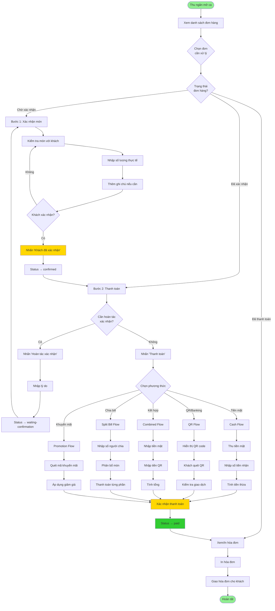

# Luồng Thanh Toán Hoàn Chỉnh - Thu Ngân Quầy
## SapaForest Restaurant Management System

---

**Ngày tạo:** 20/01/2025  
**Phiên bản:** 1.0  
**Đối tượng:** Thu ngân quầy (Cashier)  
**Mục đích:** Hướng dẫn chi tiết quy trình thanh toán và xử lý các tình huống phát sinh

---

## 📋 Mục Lục

1. [Tổng Quan](#1-tổng-quan)
2. [Các Bước Trong Luồng Thanh Toán](#2-các-bước-trong-luồng-thanh-toán)
3. [Chi Tiết Từng Bước](#3-chi-tiết-từng-bước)
4. [Xử Lý Tình Huống Đặc Biệt](#4-xử-lý-tình-huống-đặc-biệt)
5. [Xử Lý Lỗi và Edge Cases](#5-xử-lý-lỗi-và-edge-cases)
6. [Quy Trình Hoàn Tiền và Điều Chỉnh](#6-quy-trình-hoàn-tiền-và-điều-chỉnh)
7. [Best Practices](#7-best-practices)
8. [FAQ - Câu Hỏi Thường Gặp](#8-faq---câu-hỏi-thường-gặp)

---

## 1. Tổng Quan

### 1.1. Vai Trò Thu Ngân Quầy

Thu ngân quầy (Cashier) chịu trách nhiệm:
- ✅ Xác nhận món ăn/đồ uống khách đã sử dụng
- ✅ Tính toán và kiểm tra hóa đơn
- ✅ Thu tiền từ khách hàng
- ✅ Xử lý các phương thức thanh toán
- ✅ In và giao hóa đơn cho khách
- ✅ Xử lý các tình huống phát sinh

**⚠️ LƯU Ý QUAN TRỌNG:**
- Thu ngân **CHỈ BẮT ĐẦU** quy trình thanh toán khi khách **ĐÃ ĂN XONG** và **RA QUẦY YÊU CẦU THANH TOÁN**
- Sau khi khách xác nhận đơn hàng → **KHÔNG ĐƯỢC PHÉP THÊM MÓN** vào order nữa
- Nếu khách muốn thêm món sau khi đã xác nhận → Phải **HOÀN TÁC XÁC NHẬN** trước, thêm món, rồi xác nhận lại

### 1.2. Luồng Chính (Happy Path)

```
[Tiền điều kiện: Khách ăn xong, ra quầy yêu cầu thanh toán]
    ↓
[1] Chọn đơn hàng cần thanh toán
    ↓
[2] Xác nhận món với khách (Khách kiểm tra và xác nhận)
    ↓
[3] 🔒 ĐÃ KHÓA - Không thể thêm món nữa
    ↓
[4] Chọn phương thức thanh toán
    ↓
[5] Thực hiện thanh toán
    ↓
[6] In và giao hóa đơn
    ↓
[7] Hoàn tất
```

**Quy tắc quan trọng:**
- ⏰ Thu ngân chỉ làm việc với đơn hàng khi khách **ĐÃ ĂN XONG**
- 🔒 Sau bước [2] (xác nhận), đơn hàng bị **KHÓA** - không thể thêm/sửa món
- 🔄 Nếu cần thay đổi → Phải **hoàn tác xác nhận** → thêm món → xác nhận lại

### 1.3. Các Trạng Thái Đơn Hàng

| Trạng thái | Tên hiển thị | Màu | Ý nghĩa | Cho phép thêm món? |
|------------|--------------|-----|---------|-------------------|
| `waiting-confirmation` | Chờ xác nhận | 🟡 Vàng | Khách chưa xác nhận món | ✅ CÓ (qua Waiter) |
| `confirmed` | Đã xác nhận | 🔵 Xanh dương | Khách đã xác nhận, chờ thanh toán | ❌ KHÔNG |
| `pending-payment` | Chờ thanh toán | 🔵 Xanh nhạt | Đang xử lý thanh toán | ❌ KHÔNG |
| `paid` | Đã thanh toán | 🟢 Xanh lá | Đã thanh toán xong | ❌ KHÔNG |
| `partially-paid` | Thanh toán 1 phần | 🟠 Cam | Chia bill, chưa thanh toán hết | ❌ KHÔNG |
| `cancelled` | Đã hủy | 🔴 Đỏ | Đơn bị hủy | ❌ KHÔNG |

**⚠️ Business Rule:**
- **Chỉ có trạng thái `waiting-confirmation`** mới cho phép thêm món (thông qua Waiter)
- **Từ `confirmed` trở đi** → Đơn hàng bị KHÓA, không thể thêm/sửa món
- Nếu cần thêm món sau khi đã `confirmed` → Phải **Hoàn tác xác nhận** trước

---

## 2. Business Rules - Quy Tắc Nghiệp Vụ Quan Trọng

### 2.1. 🔒 Quy Tắc: Không Thêm Món Sau Khi Xác Nhận

**Nguyên tắc cốt lõi:**
> **Sau khi khách xác nhận đơn hàng (Status = `confirmed`) → Đơn hàng bị KHÓA → KHÔNG ĐƯỢC PHÉP thêm món**

**Lý do:**

1. **Đảm bảo tính nhất quán:**
   - 1 lần ăn = 1 lần xác nhận = 1 lần thanh toán
   - Tránh phải thanh toán nhiều lần cho cùng 1 bữa ăn

2. **Tránh gian lận:**
   - Sau khi thanh toán → Không thể thêm món vào đơn cũ
   - Mỗi món phải được xác nhận trước khi thanh toán

3. **Đảm bảo khách đã ăn xong:**
   - Thu ngân chỉ làm việc với đơn khi khách **ĐÃ ĂN XONG**
   - Xác nhận = khách đã ăn hết tất cả món và sẵn sàng thanh toán

**Workflow đúng:**

```
Khách đặt món → Waiter ghi order → Bếp làm món
                                        ↓
                                  Phục vụ cho khách
                                        ↓
                                  Khách ăn xong
                                        ↓
                        Khách ra quầy yêu cầu thanh toán
                                        ↓
                            Thu ngân xác nhận với khách
                                        ↓
                        🔒 ĐƠN BỊ KHÓA - Không thêm món
                                        ↓
                                  Thanh toán
                                        ↓
                                  Hoàn tất
```

**Nếu khách muốn thêm món:**

**Trường hợp 1: TRƯỚC khi xác nhận**
- ✅ Bình thường: Gọi Waiter → Thêm món → Chờ món ra → Ăn xong → Xác nhận

**Trường hợp 2: SAU khi đã xác nhận**
- ❌ KHÔNG thể thêm trực tiếp
- ✅ Phải: Hoàn tác xác nhận → Thêm món → Chờ món ra → Ăn xong → Xác nhận lại

**Trường hợp 3: SAU khi đã thanh toán**
- ❌ HOÀN TOÀN KHÔNG thể thêm vào đơn cũ
- ✅ Phải: Tạo đơn mới → Khách ăn → Thanh toán đơn mới

---

### 2.2. ⏰ Quy Tắc: Thu Ngân Chỉ Làm Việc Với Khách Đã Ăn Xong

**Nguyên tắc:**
> **Thu ngân CHỈ BẮT ĐẦU xử lý đơn hàng khi khách ĐÃ ĂN XONG và RA QUẦY YÊU CẦU THANH TOÁN**

**KHÔNG đúng:**
- ❌ Khách đang ăn → Thu ngân xác nhận trước
- ❌ Khách vừa gọi món → Thu ngân xác nhận luôn
- ❌ Khách nói "em chuẩn bị đi" → Thu ngân xác nhận ngay

**Đúng:**
- ✅ Khách đã ăn xong, ra quầy: "Em tính tiền!"
- ✅ Khách gọi Waiter: "Em lấy bill!"
- ✅ Waiter báo thu ngân: "Bàn B05 xin bill ạ"

**Lý do:**
- Đảm bảo khách đã dùng HẾT tất cả món đã đặt
- Tránh tình huống: Xác nhận xong → Món mới ra → Phải xử lý lại
- Đảm bảo chất lượng phục vụ: Không gây áp lực cho khách

---

## 3. Các Bước Trong Luồng Thanh Toán

### 2.1. Sơ Đồ Tổng Quan



### 2.2. Timeline Thời Gian

```
T=0:    Khách ngồi vào bàn, waiter tiếp đón
T=5:    Waiter ghi order, gửi bếp
T=20:   Bếp hoàn tất món, phục vụ cho khách
T=45:   Khách ăn xong, yêu cầu thanh toán
        ↓
T=46:   Thu ngân mở màn hình OrderSelection
T=47:   Chọn đơn hàng, mở ConfirmOrder.cshtml
T=48:   Xác nhận số lượng món với khách
T=49:   Nhấn "Khách đã xác nhận"
        ↓ (Status: waiting-confirmation → confirmed)
T=50:   Nhấn "Thanh toán", mở Payment.cshtml
T=51:   Khách chọn phương thức thanh toán
T=52:   Thu tiền/xác nhận QR
T=53:   Nhấn "Xác nhận thanh toán"
        ↓ (Status: confirmed → paid)
T=54:   Mở Receipt.cshtml, in hóa đơn
T=55:   Giao hóa đơn cho khách
        ↓
T=56:   Khách rời quán, hoàn tất
```

---

## 3. Chi Tiết Từng Bước

### BƯỚC 1: Chọn Đơn Hàng Cần Xử Lý

#### 3.1.1. Màn Hình: OrderSelection.cshtml

**URL:** `/cashier-flow/orders`

**Chức năng:**
- Hiển thị danh sách tất cả đơn hàng trong ngày
- Phân loại theo trạng thái: Pending (chờ xử lý) / Processed (đã xong)
- Filter theo ngày
- Tìm kiếm theo bàn, mã đơn, tên khách

**Giao Diện:**

```
┌─────────────────────────────────────────────────────┐
│  📅 Ngày: [20/01/2025 ▼]       🔍 [Tìm kiếm...]     │
├─────────────────────────────────────────────────────┤
│  Tab: [Chờ xử lý (5)] | [Đã xong (12)]             │
├─────────────────────────────────────────────────────┤
│  ┌─────────────────────────────────────────────┐   │
│  │ 🟡 Đơn #1234 - Bàn B05                      │   │
│  │ Khách: Nguyễn Văn A                         │   │
│  │ Tạo lúc: 12:30 | Tổng: 450,000đ             │   │
│  │ [Xem chi tiết]                              │   │
│  └─────────────────────────────────────────────┘   │
│  ┌─────────────────────────────────────────────┐   │
│  │ 🔵 Đơn #1235 - Bàn B02                      │   │
│  │ Khách: Trần Thị B                           │   │
│  │ Tạo lúc: 12:45 | Tổng: 780,000đ             │   │
│  │ [Thanh toán]                                │   │
│  └─────────────────────────────────────────────┘   │
└─────────────────────────────────────────────────────┘
```

**Hành Động:**
1. ✅ Xem danh sách đơn hàng
2. ✅ Click vào đơn cần xử lý
3. ✅ Hệ thống chuyển sang màn hình tương ứng:
   - Nếu status = `waiting-confirmation` → ConfirmOrder.cshtml
   - Nếu status = `confirmed` → ConfirmOrder.cshtml (có nút Thanh toán)
   - Nếu status = `paid` → Receipt.cshtml

**Lưu Ý:**
- ⚠️ Ưu tiên xử lý đơn cũ trước (theo thời gian tạo)
- ⚠️ Đơn có badge 🟡 (vàng) = chờ xác nhận
- ⚠️ Đơn có badge 🔵 (xanh) = đã xác nhận, cần thanh toán

---

### BƯỚC 2: Xác Nhận Món Với Khách

#### 3.2.1. Màn Hình: ConfirmOrder.cshtml

**URL:** `/cashier-flow/orders/{orderId}`

**Điều Kiện:** Order status = `waiting-confirmation`

**Mục Đích:**
- Kiểm tra lại món ăn/đồ uống khách đã dùng
- Xác nhận số lượng thực tế (có thể khác số lượng đặt)
- Ghi chú điều chỉnh nếu có

**Giao Diện:**

```
┌───────────────────────────────────────────────────────┐
│  ← Quay lại          Đơn #1234 - Bàn B05             │
│  🟡 Chờ xác nhận     Khách: Nguyễn Văn A              │
├───────────────────────────────────────────────────────┤
│  Danh Sách Món / Đồ Uống                              │
├────┬──────────────┬────────┬────────────┬────────────┤
│ STT│ Tên Món      │ SL Đặt │ SL Dùng    │ Thành Tiền │
├────┼──────────────┼────────┼────────────┼────────────┤
│ 1  │ Steak Sapa   │   2    │ [2▼]       │ 490,000đ   │
│    │ Ghi chú: [Không hành         ]                   │
├────┼──────────────┼────────┼────────────┼────────────┤
│ 2  │ Trà sen      │   2    │ [1▼]       │  45,000đ   │
│    │ Ghi chú: [Khách không dùng ly 2    ]             │
├────┼──────────────┼────────┼────────────┼────────────┤
│ 3  │ Lẩu cá hồi   │   1    │ [1▼]       │ 320,000đ   │
│    │ Ghi chú: [                    ]                  │
├────┴──────────────┴────────┴────────────┴────────────┤
│                                Tạm tính:   855,000đ   │
│                                VAT (10%):   85,500đ   │
│                           Phí dịch vụ (5%): 42,750đ   │
│  ───────────────────────────────────────────────────  │
│                    Tổng cộng thanh toán: 983,250đ     │
├───────────────────────────────────────────────────────┤
│              [Khách đã xác nhận]                      │
└───────────────────────────────────────────────────────┘
```

**Quy Trình Xác Nhận:**

1. **Bước 2.1: Kiểm tra món với khách**
   ```
   Thu ngân: "Chào anh/chị, cho em xác nhận món ạ:
             - 2 phần Steak Sapa
             - 2 ly Trà sen
             - 1 phần Lẩu cá hồi
             Anh/chị có dùng hết không ạ?"
   
   Khách:    "Trà sen em chỉ dùng 1 ly thôi, ly còn lại không dùng."
   ```

2. **Bước 2.2: Điều chỉnh số lượng**
   - Click vào dropdown "SL Dùng" của món Trà sen
   - Chọn "1" thay vì "2"
   - Nhập ghi chú: "Khách không dùng ly 2"
   - Hệ thống tự động tính lại tổng tiền

3. **Bước 2.3: Xác nhận với khách**
   ```
   Thu ngân: "Vậy tổng cộng là 983,250đ ạ. Anh/chị xác nhận ạ?"
   Khách:    "Được, đúng rồi."
   ```

4. **Bước 2.4: Hoàn tất xác nhận**
   - Click nút **"Khách đã xác nhận"**
   - Hệ thống:
     * Lưu số lượng thực tế vào database
     * Cập nhật `order.Status = "confirmed"`
     * Ghi timestamp `order.ConfirmedAt = DateTime.UtcNow`
     * Lưu `order.ConfirmedByStaffId = {cashier_staff_id}`
     * Hiển thị toast: "✅ Đã xác nhận đơn hàng thành công"
     * Page reload, hiển thị nút "Hoàn tác xác nhận" và "Thanh toán"

**Validation:**
- ⚠️ Bắt buộc nhập số lượng cho tất cả các món
- ⚠️ Số lượng dùng ≤ Số lượng đặt
- ⚠️ Số lượng dùng ≥ 0
- ⚠️ Nếu số lượng = 0, bắt buộc nhập ghi chú lý do

**Backend API:**
```http
PUT /api/payment/orders/{orderId}/confirm
Content-Type: application/json

{
  "orderId": 1234,
  "items": [
    {
      "orderDetailId": 101,
      "quantityUsed": 2,
      "isRemoved": false,
      "notes": "Không hành"
    },
    {
      "orderDetailId": 102,
      "quantityUsed": 1,
      "isRemoved": false,
      "notes": "Khách không dùng ly 2"
    },
    {
      "orderDetailId": 103,
      "quantityUsed": 1,
      "isRemoved": false,
      "notes": ""
    }
  ]
}
```

**Response Success:**
```json
{
  "orderId": 1234,
  "status": "confirmed",
  "confirmedAt": "2025-01-20T14:30:00Z",
  "totalAmount": 983250,
  "items": [...]
}
```

---

### BƯỚC 3: Hoàn Tác Xác Nhận (Nếu Cần)

#### 3.3.1. Tình Huống Cần Hoàn Tác

**Các trường hợp:**
1. ❌ Thu ngân xác nhận nhầm số lượng
2. ❌ Khách phát hiện thiếu món sau khi xác nhận
3. ❌ Khách muốn thêm món sau khi đã xác nhận
4. ❌ Thu ngân nhấn nhầm nút "Khách đã xác nhận"

**Điều Kiện:**
- ✅ Order status = `confirmed`
- ✅ Chưa có Payment transaction (chưa nhấn thanh toán)
- ✅ Bếp chưa bắt đầu chế biến món bổ sung (nếu có)

**Quy Trình:**

1. **Bước 3.1: Mở modal hoàn tác**
   - Click nút **"Hoàn tác xác nhận"** (màu vàng, icon undo)
   - Modal xuất hiện:

```
┌─────────────────────────────────────────┐
│  Hoàn tác xác nhận đơn hàng        ✕    │
├─────────────────────────────────────────┤
│  Lý do hoàn tác: *                      │
│  ┌─────────────────────────────────────┐│
│  │ Thu ngân xác nhận nhầm số lượng   ││
│  │                                     ││
│  └─────────────────────────────────────┘│
│                                          │
│  ⚠️ Đơn hàng sẽ quay về trạng thái      │
│  "Chờ xác nhận". Bạn có chắc chắn?     │
├─────────────────────────────────────────┤
│      [Hủy]    [✓ Xác nhận hoàn tác]    │
└─────────────────────────────────────────┘
```

2. **Bước 3.2: Nhập lý do bắt buộc**
   - Textarea yêu cầu nhập lý do (required)
   - Lý do phải >= 10 ký tự
   - Các lý do thường gặp:
     * "Thu ngân xác nhận nhầm số lượng"
     * "Khách muốn điều chỉnh số lượng"
     * "Khách phát hiện thiếu món"
     * "Nhấn nhầm nút xác nhận"

3. **Bước 3.3: Xác nhận hoàn tác**
   - Click **"Xác nhận hoàn tác"**
   - Hệ thống:
     * Cập nhật `order.Status = "waiting-confirmation"`
     * Xóa `order.ConfirmedAt` và `order.ConfirmedByStaffId`
     * Tạo record `OrderHistory`:
       ```
       Action: "Undo Confirmation"
       Reason: "{lý do thu ngân nhập}"
       StaffId: {cashier_staff_id}
       CreatedAt: {timestamp}
       ```
     * Toast hiển thị: "✅ Đã hoàn tác xác nhận thành công!"
     * Page reload về trạng thái chờ xác nhận

4. **Bước 3.4: Xác nhận lại**
   - Thu ngân điều chỉnh số lượng đúng
   - Nhấn "Khách đã xác nhận" lần nữa
   - Tiếp tục quy trình thanh toán

**Backend API:**
```http
PUT /api/payment/orders/{orderId}/undo-confirm
Content-Type: application/json

{
  "staffId": 5,
  "reason": "Thu ngân xác nhận nhầm số lượng"
}
```

**Response Success:**
```json
{
  "success": true,
  "message": "Order reverted successfully.",
  "orderId": 1234,
  "status": "waiting-confirmation"
}
```

**Lưu Ý:**
- ⚠️ Chỉ được hoàn tác KHI CHƯA THANH TOÁN
- ⚠️ Nếu đã thanh toán → Không thể hoàn tác, cần quy trình hoàn tiền
- ⚠️ Lý do hoàn tác được lưu vào `OrderHistory` để audit

---

### BƯỚC 4: Chọn Phương Thức Thanh Toán

#### 3.4.1. Màn Hình: Payment.cshtml

**URL:** `/cashier-flow/payment/{orderId}`

**Điều Kiện:** Order status = `confirmed`

**Giao Diện:**

```
┌────────────────────────────────────────────────────────┐
│  ← Quay lại         Đơn #1234 - Thanh Toán            │
│  🔵 Đã xác nhận     Bàn: B05 | Khách: Nguyễn Văn A    │
├────────────────────────────────────────────────────────┤
│  Tóm Tắt Đơn Hàng                                      │
├────┬───────────────────────┬────────────┬─────────────┤
│ STT│ Tên Món/Combo         │ Số Lượng   │ Thành Tiền  │
├────┼───────────────────────┼────────────┼─────────────┤
│ 1  │ Steak Sapa Signature  │     2      │  490,000đ   │
│ 2  │ Trà sen Tuyết         │     1      │   45,000đ   │
│ 3  │ Lẩu cá hồi Fansipan   │     1      │  320,000đ   │
├────┴───────────────────────┴────────────┴─────────────┤
│                                  Tạm tính:   855,000đ  │
│                                  VAT (10%):   85,500đ  │
│                             Phí dịch vụ (5%):  42,750đ  │
│  ────────────────────────────────────────────────────  │
│                      Tổng cộng thanh toán: 983,250đ    │
├────────────────────────────────────────────────────────┤
│  Chọn Phương Thức Thanh Toán:                          │
│                                                         │
│  ┌──────────────┐  ┌──────────────┐  ┌──────────────┐ │
│  │   💵 TIỀN    │  │  📱 QR CODE  │  │ 🔀 KẾT HỢP   │ │
│  │     MẶT      │  │   / BANKING  │  │              │ │
│  └──────────────┘  └──────────────┘  └──────────────┘ │
│                                                         │
│  ┌──────────────┐  ┌──────────────┐                    │
│  │ ✂️ CHIA BILL │  │ 🎁 KHUYẾN MÃI│                    │
│  │              │  │              │                    │
│  └──────────────┘  └──────────────┘                    │
└────────────────────────────────────────────────────────┘
```

**5 Phương Thức Thanh Toán:**

---

#### 3.4.2. Phương Thức 1: TIỀN MẶT (Cash)

**Khi Nào Dùng:**
- Khách trả bằng tiền mặt 100%
- Phương thức phổ biến nhất

**Quy Trình:**

1. **Click nút "💵 TIỀN MẶT"**
   - Modal xuất hiện:

```
┌─────────────────────────────────────────┐
│  Thanh Toán Tiền Mặt             ✕     │
├─────────────────────────────────────────┤
│  Tổng tiền cần thanh toán:              │
│  983,250đ                                │
│                                          │
│  Số tiền khách đưa: *                   │
│  ┌─────────────────────────────────────┐│
│  │ 1,000,000                          ││
│  └─────────────────────────────────────┘│
│                                          │
│  Tiền thừa trả khách:                   │
│  16,750đ                                 │
│                                          │
│  Ghi chú (tùy chọn):                    │
│  ┌─────────────────────────────────────┐│
│  │                                     ││
│  └─────────────────────────────────────┘│
├─────────────────────────────────────────┤
│      [Hủy]    [✓ Xác nhận thanh toán]  │
└─────────────────────────────────────────┘
```

2. **Nhập số tiền khách đưa**
   - Thu ngân nhập: 1,000,000
   - Hệ thống tự động tính tiền thừa: 1,000,000 - 983,250 = 16,750đ

3. **Validation:**
   - ✅ Số tiền nhận >= Tổng tiền cần thanh toán
   - ❌ Nếu < → Hiển thị lỗi: "Số tiền nhận không đủ!"
   - ⚠️ Nếu > 5,000,000đ → Cảnh báo: "Số tiền quá lớn, vui lòng kiểm tra lại"

4. **Thu tiền và trả lại**
   ```
   Thu ngân: "Tổng cộng 983,250đ ạ."
   Khách:    [Đưa 1,000,000đ]
   Thu ngân: [Nhận tiền, đếm kiểm tra]
             [Nhập vào hệ thống: 1,000,000]
             "Anh/chị nhận lại 16,750đ ạ."
   Khách:    [Nhận tiền thừa]
   ```

5. **Click "Xác nhận thanh toán"**
   - Hệ thống:
     * Tạo Payment record:
       ```
       OrderId: 1234
       PaymentMethod: "Cash"
       Subtotal: 855,000
       VATAmount: 85,500
       ServiceFee: 42,750
       FinalAmount: 983,250
       PaymentDate: DateTime.UtcNow
       ```
     * Cập nhật `order.Status = "paid"`
     * Toast: "✅ Thanh toán thành công!"
     * Chuyển sang Receipt.cshtml

**Backend API:**
```http
POST /api/payment/payments/cash
Content-Type: application/json

{
  "orderId": 1234,
  "amountReceived": 1000000,
  "notes": ""
}
```

---

#### 3.4.3. Phương Thức 2: QR CODE / BANKING

**Khi Nào Dùng:**
- Khách quét QR chuyển khoản
- Khách chuyển khoản ngân hàng
- Ví điện tử (MoMo, ZaloPay, VNPay)

**Quy Trình:**

1. **Click nút "📱 QR CODE / BANKING"**
   - Form nhập thông tin:

```
┌─────────────────────────────────────────┐
│  Thanh Toán QR / Chuyển Khoản    ✕     │
├─────────────────────────────────────────┤
│  Chọn phương thức:                      │
│  ( ) QR Code Ngân Hàng                  │
│  ( ) MoMo                                │
│  (•) VNPay                               │
│  ( ) ZaloPay                             │
│                                          │
│  Số tiền: 983,250đ                       │
│                                          │
│         [Tạo mã QR]                     │
└─────────────────────────────────────────┘
```

2. **Click "Tạo mã QR"**
   - Hệ thống gọi API tạo QR:

```http
POST /api/payment/payments/initiate
Content-Type: application/json

{
  "orderId": 1234,
  "method": "QR",
  "provider": "VNPay",
  "amount": 983250
}
```

3. **Hiển thị QR Code: PaymentConfirm.cshtml**

```
┌─────────────────────────────────────────┐
│  ← Quay lại chọn phương thức            │
├─────────────────────────────────────────┤
│  Quét Mã QR Để Thanh Toán               │
│                                          │
│  ┌─────────────┐    Số tiền: 983,250đ  │
│  │             │    Ngân hàng: VNPay    │
│  │  [QR CODE]  │    Mã GD: TXN-20250120│
│  │             │                         │
│  └─────────────┘    Trạng thái:         │
│                     ⏳ Đang chờ thanh toán│
│                                          │
│  Hướng dẫn:                             │
│  1. Mở ứng dụng Banking/Ví điện tử      │
│  2. Quét mã QR phía trên                │
│  3. Xác nhận giao dịch                  │
│  4. Nhấn "Xác nhận giao dịch" bên dưới  │
│                                          │
│  ⏱️ Tự động kiểm tra sau: 5 giây       │
├─────────────────────────────────────────┤
│      [← Quay lại]  [✓ Xác nhận giao dịch]│
└─────────────────────────────────────────┘
```

4. **Khách quét QR và thanh toán**
   ```
   Thu ngân: "Anh/chị vui lòng quét mã QR này để thanh toán ạ."
   Khách:    [Mở app MoMo/Banking, quét QR]
             [Xác nhận thanh toán trên điện thoại]
             "Em ơi, em đã chuyển xong rồi nhé."
   ```

5. **Thu ngân click "Xác nhận giao dịch"**
   - Hệ thống gọi API kiểm tra:

```http
POST /api/payment/payments/confirm
Content-Type: application/json

{
  "orderId": 1234,
  "sessionId": "TXN-20250120-001",
  "transactionId": "VNP20250120145500"
}
```

6. **Hệ thống verify giao dịch:**
   - ✅ Nếu giao dịch thành công:
     * Payment.PaymentDate = DateTime.UtcNow
     * Order.Status = "paid"
     * Chuyển sang Receipt.cshtml
   
   - ❌ Nếu chưa nhận được tiền:
     * Hiển thị lỗi: "Chưa nhận được giao dịch. Vui lòng kiểm tra lại."
     * Đề xuất: "Quay lại chọn phương thức" hoặc "Thử lại"

**Lưu Ý:**
- ⏱️ QR code có thời gian hiệu lực (thường 15 phút)
- 🔄 Hệ thống tự động polling kiểm tra giao dịch mỗi 5 giây
- ⚠️ Nếu timeout → Yêu cầu tạo QR mới
- 📞 Nếu khách đã chuyển nhưng hệ thống chưa nhận → Liên hệ IT support

---

#### 3.4.4. Phương Thức 3: KẾT HỢP (Cash + QR)

**Khi Nào Dùng:**
- Khách trả 1 phần tiền mặt, 1 phần chuyển khoản
- Ví dụ: Tổng 983,250đ → 500,000đ tiền mặt + 483,250đ chuyển khoản

**Quy Trình:**

1. **Click nút "🔀 KẾT HỢP"**
   - Modal xuất hiện:

```
┌─────────────────────────────────────────┐
│  Thanh Toán Kết Hợp              ✕     │
├─────────────────────────────────────────┤
│  Tổng tiền cần thanh toán: 983,250đ     │
│                                          │
│  💵 Tiền mặt:                           │
│  ┌─────────────────────────────────────┐│
│  │ 500,000                            ││
│  └─────────────────────────────────────┘│
│                                          │
│  📱 Chuyển khoản/QR:                    │
│  ┌─────────────────────────────────────┐│
│  │ 483,250                            ││
│  └─────────────────────────────────────┘│
│                                          │
│  ✅ Tổng: 983,250đ (Đủ)                 │
│                                          │
│  [Tạo QR cho phần chuyển khoản]        │
├─────────────────────────────────────────┤
│      [Hủy]    [Tiếp tục]                │
└─────────────────────────────────────────┘
```

2. **Nhập số tiền từng phương thức**
   - Thu ngân: "Anh/chị muốn thanh toán thế nào ạ?"
   - Khách: "Em trả 500 nghìn tiền mặt, còn lại chuyển khoản nhé."
   - Thu ngân nhập:
     * Tiền mặt: 500,000
     * Chuyển khoản: Tự động tính = 983,250 - 500,000 = 483,250

3. **Validation:**
   - ✅ Tổng (tiền mặt + chuyển khoản) = Tổng tiền cần thanh toán
   - ⚠️ Nếu không đủ → Hiển thị: "⚠️ Còn thiếu: {số tiền}đ"
   - ⚠️ Nếu thừa → Hiển thị: "⚠️ Thừa: {số tiền}đ"

4. **Click "Tạo QR cho phần chuyển khoản"**
   - Tạo QR với số tiền 483,250đ
   - Luồng tương tự QR payment ở trên

5. **Thu tiền mặt và chuyển khoản**
   ```
   Thu ngân: [Nhận 500,000đ tiền mặt trước]
             "Anh/chị vui lòng quét QR để chuyển 483,250đ ạ."
   Khách:    [Quét QR, chuyển khoản]
   Thu ngân: [Xác nhận giao dịch]
   ```

6. **Hệ thống tạo 2 Payment records:**
   ```
   Payment 1:
     Method: "Cash"
     Amount: 500,000
     ParentTransactionId: TXN-COMBINED-001
   
   Payment 2:
     Method: "QR"
     Amount: 483,250
     ParentTransactionId: TXN-COMBINED-001
   ```

7. **Order.Status = "paid"**, chuyển sang Receipt

---

#### 3.4.5. Phương Thức 4: CHIA BILL (Split Bill)

**Khi Nào Dùng:**
- Nhóm khách muốn chia tiền
- Ví dụ: 4 người ăn, mỗi người trả 1 phần

**Quy Trình:**

1. **Click nút "✂️ CHIA BILL"**
   - Modal xuất hiện:

```
┌─────────────────────────────────────────┐
│  Chia Bill                       ✕     │
├─────────────────────────────────────────┤
│  Tổng tiền: 983,250đ                     │
│                                          │
│  Số người chia:                         │
│  ┌─────┐                                │
│  │  4  │ người                          │
│  └─────┘                                │
│                                          │
│  Mỗi người: 245,813đ                     │
│  (Làm tròn: 246,000đ/người)             │
│                                          │
│  Phương thức chia:                      │
│  (•) Chia đều                            │
│  ( ) Chia theo món (tùy chọn)           │
├─────────────────────────────────────────┤
│      [Hủy]    [Tiếp tục]                │
└─────────────────────────────────────────┘
```

2. **Chọn "Chia đều"**
   - Hệ thống tự động chia: 983,250 / 4 = 245,812.5đ
   - Làm tròn: 246,000đ/người
   - Click "Tiếp tục"

3. **Màn hình thu tiền từng người:**

```
┌─────────────────────────────────────────┐
│  Thu Tiền Từng Người              ✕     │
├─────────────────────────────────────────┤
│  Người 1:  [✓ Đã thu] 246,000đ  [Cash] │
│  Người 2:  [✓ Đã thu] 246,000đ  [QR]   │
│  Người 3:  [ Chưa thu] 246,000đ        │
│  Người 4:  [ Chưa thu] 246,000đ        │
│  ─────────────────────────────────────  │
│  Đã thu: 492,000đ / 984,000đ            │
│  Còn lại: 492,000đ                       │
├─────────────────────────────────────────┤
│  Đang thu tiền: Người 3                 │
│  Phương thức: [Cash ▼] [QR ▼]          │
│                [✓ Xác nhận]             │
└─────────────────────────────────────────┘
```

4. **Thu từng người một:**
   ```
   Thu ngân: "Người thứ 3 thanh toán 246,000đ ạ."
   Người 3:  [Đưa 246,000đ tiền mặt]
   Thu ngân: [Click "Xác nhận"]
             ✅ Người 3 đã thu xong
             
             "Người thứ 4 thanh toán 246,000đ ạ."
   Người 4:  "Em chuyển khoản được không?"
   Thu ngân: [Chọn "QR", tạo QR 246,000đ]
   Người 4:  [Quét QR, thanh toán]
   Thu ngân: [Xác nhận giao dịch]
             ✅ Người 4 đã thu xong
   ```

5. **Khi thu đủ 4 người:**
   - Tổng đã thu = 984,000đ (4 x 246,000)
   - Thực tế cần thu = 983,250đ
   - Thừa = 750đ → Tự động điều chỉnh hoặc làm tròn

6. **Hệ thống:**
   - Tạo 4 Payment records (mỗi người 1 record)
   - Order.Status = "paid"
   - Chuyển sang Receipt

**Lưu Ý:**
- ⚠️ Cho phép "Tạm thu" nếu chưa đủ người → Order.Status = "partially-paid"
- 📊 Hệ thống track từng người đã trả bao nhiêu
- 🔄 Nếu 1 người hủy → Thu ngân phải điều chỉnh lại

---

#### 3.4.6. Phương Thức 5: KHUYẾN MÃI (Promotion)

**Khi Nào Dùng:**
- Khách có mã giảm giá / voucher
- Chương trình khuyến mãi đặc biệt
- Member VIP / Loyalty points

**Quy Trình:**

1. **Click nút "🎁 KHUYẾN MÃI"**
   - Modal xuất hiện:

```
┌─────────────────────────────────────────┐
│  Áp Dụng Khuyến Mãi              ✕     │
├─────────────────────────────────────────┤
│  Tổng tiền ban đầu: 983,250đ            │
│                                          │
│  Mã khuyến mãi:                         │
│  ┌─────────────────────────────────────┐│
│  │ SAPAFOREST20                       ││
│  └─────────────────────────────────────┘│
│                [Kiểm tra mã]            │
│                                          │
│  Hoặc dùng Loyalty Points:              │
│  Khách có: 1,500 điểm (= 150,000đ)     │
│  Sử dụng: [____] điểm                   │
│                                          │
│  ─────────────────────────────────────  │
│  Giảm giá: 0đ                            │
│  Thành tiền: 983,250đ                    │
├─────────────────────────────────────────┤
│      [Hủy]    [Áp dụng]                 │
└─────────────────────────────────────────┘
```

2. **Nhập mã khuyến mãi**
   - Thu ngân: "Anh/chị có mã giảm giá không ạ?"
   - Khách: "Có, mã SAPAFOREST20."
   - Thu ngân nhập: `SAPAFOREST20`
   - Click "Kiểm tra mã"

3. **Hệ thống validate mã:**

```http
POST /api/promotions/validate
Content-Type: application/json

{
  "promotionCode": "SAPAFOREST20",
  "orderId": 1234,
  "customerId": 567,
  "orderAmount": 983250
}
```

4. **Response nếu hợp lệ:**
```json
{
  "valid": true,
  "discountType": "percentage",
  "discountValue": 20,
  "discountAmount": 196650,
  "finalAmount": 786600,
  "message": "Giảm 20% tổng hóa đơn"
}
```

5. **Hiển thị kết quả:**
```
┌─────────────────────────────────────────┐
│  ✅ Mã hợp lệ: SAPAFOREST20             │
│  Giảm giá: 20% (196,650đ)               │
│  ─────────────────────────────────────  │
│  Tổng ban đầu: 983,250đ                 │
│  Giảm giá:    -196,650đ                 │
│  Thành tiền:   786,600đ                 │
├─────────────────────────────────────────┤
│      [Hủy]    [✓ Áp dụng và thanh toán] │
└─────────────────────────────────────────┘
```

6. **Click "Áp dụng và thanh toán"**
   - Thu ngân chọn phương thức (Cash/QR)
   - Thu tiền 786,600đ (sau giảm giá)
   - Hệ thống:
     * Lưu `Payment.DiscountAmount = 196,650`
     * Lưu `Payment.PromotionCode = "SAPAFOREST20"`
     * `Payment.FinalAmount = 786,600`
     * `Order.Status = "paid"`

7. **Hoặc dùng Loyalty Points:**
   - Khách: "Em muốn dùng điểm tích lũy."
   - Thu ngân: Nhập số điểm muốn dùng (ví dụ: 1,000 điểm)
   - Hệ thống quy đổi: 1,000 điểm = 100,000đ
   - Giảm trừ: 983,250 - 100,000 = 883,250đ
   - Thu tiền 883,250đ

---

### BƯỚC 5: Xác Nhận Thanh Toán và In Hóa Đơn

#### 3.5.1. Màn Hình: Receipt.cshtml

**URL:** `/cashier-flow/receipt/{orderId}`

**Điều Kiện:** Order status = `paid`

**Giao Diện:**

```
┌────────────────────────────────────────────────────────┐
│  ← Quay lại danh sách         HÓA ĐƠN THANH TOÁN      │
│  🟢 Đã thanh toán              SapaForest Restaurant   │
├────────────────────────────────────────────────────────┤
│  Mã đơn: #1234                 Bàn: B05               │
│  Ngày: 20/01/2025 14:35        Khách: Nguyễn Văn A    │
│  Cashier: Thu Ngân 01          SĐT: 0901234567        │
├────────────────────────────────────────────────────────┤
│  CHI TIẾT ĐƠN HÀNG                                     │
├────┬───────────────────────┬─────────┬────────────────┤
│ STT│ Món/Combo             │ Số Lượng│ Thành Tiền     │
├────┼───────────────────────┼─────────┼────────────────┤
│ 1  │ Steak Sapa Signature  │    2    │    490,000đ    │
│ 2  │ Trà sen Tuyết         │    1    │     45,000đ    │
│ 3  │ Lẩu cá hồi Fansipan   │    1    │    320,000đ    │
├────┴───────────────────────┴─────────┴────────────────┤
│                                        Tạm tính:  855,000đ│
│                                        VAT (10%):  85,500đ│
│                                   Phí dịch vụ (5%): 42,750đ│
│  ──────────────────────────────────────────────────────  │
│                          Tổng cộng thanh toán: 983,250đ  │
├────────────────────────────────────────────────────────┤
│  THÔNG TIN THANH TOÁN                                  │
│  Phương thức: Tiền mặt                                 │
│  Tiền nhận:   1,000,000đ                               │
│  Tiền thừa:      16,750đ                               │
│  Thời gian:   20/01/2025 14:35:22                      │
├────────────────────────────────────────────────────────┤
│               [📄 Tải Hóa Đơn PDF]                     │
│               [🖨️ In Hóa Đơn]                          │
│               [← Quay lại danh sách]                   │
└────────────────────────────────────────────────────────┘
```

**Quy Trình:**

1. **Tự động chuyển đến Receipt sau thanh toán**
   - Order.Status = "paid"
   - Hiển thị thông tin đầy đủ

2. **In hóa đơn cho khách**
   
   **Cách 1: In trực tiếp**
   - Click **"🖨️ In Hóa Đơn"**
   - Gọi `window.print()` → In ngay trên trình duyệt
   - Chọn máy in (thermal printer hoặc A4)
   
   **Cách 2: Tải PDF**
   - Click **"📄 Tải Hóa Đơn PDF"**
   - Gọi API:

```http
GET /api/payment/receipt/{orderId}/download
```

   - Download file `HOA_DON_1234_20250120.pdf`
   - Mở PDF, in hoặc gửi email cho khách

3. **Giao hóa đơn cho khách**
   ```
   Thu ngân: "Anh/chị nhận hóa đơn ạ. Cảm ơn anh/chị và hẹn gặp lại!"
   Khách:    [Nhận hóa đơn, rời quán]
   ```

4. **Click "Quay lại danh sách"**
   - Về OrderSelection.cshtml
   - Đơn #1234 chuyển sang tab "Đã xong"
   - Sẵn sàng xử lý đơn tiếp theo

---

## 4. Xử Lý Tình Huống Đặc Biệt

### 4.1. Tình Huống 1: Khách Phát Hiện Thiếu Món (TRƯỚC KHI XÁC NHẬN)

**⏰ Thời điểm:** Khách vừa đến quầy, THU NGÂN CHƯA XÁC NHẬN đơn

**Kịch Bản:**
```
Thu ngân: "Anh/chị xác nhận đơn gồm 2 Steak và 1 Trà ạ?"
Khách:    "Khoan, em đặt 2 ly Trà mà sao chỉ có 1 ly?"
```

**Xử Lý:**

1. **Kiểm tra lại với bếp/phục vụ**
   ```
   Thu ngân: "Em xin phép kiểm tra lại với bếp ạ."
   [Gọi điện/nhắn tin cho waiter]
   Waiter:   "Bếp báo chỉ làm 1 ly, vì đơn chỉ ghi 1."
   ```

2. **Xác nhận với khách**
   - ❓ Nếu khách đúng (waiter ghi thiếu): "Em xin lỗi, em bổ sung thêm 1 ly ngay ạ."
   - ❓ Nếu khách nhầm: "Đơn em check chỉ có 1 ly ạ, anh/chị có muốn gọi thêm không?"

3. **⚠️ Trường hợp cần bổ sung món (QUAN TRỌNG):**
   - **KHÔNG XÁC NHẬN ĐỠN NGAY** ❌
   - **YÊU CẦU WAITER/MANAGER** thêm món vào order (Status vẫn = `waiting-confirmation`)
   - Chờ bếp làm và phục vụ món bổ sung
   - Khách ăn xong món bổ sung
   - **SAU ĐÓ MỚI XÁC NHẬN** đơn hàng với thu ngân

4. **Trường hợp khách không muốn chờ:**
   - Thương lượng: Miễn phí món thiếu hoặc giảm giá
   - Ghi chú vào order: "Khách từ chối chờ, miễn phí 1 ly Trà"
   - Xác nhận và thanh toán với giá đã giảm

**🔒 Business Rule:**
- Chỉ được xác nhận đơn khi khách **ĐÃ ĂN XONG TẤT CẢ MÓN**
- Nếu còn thiếu món → Bổ sung trước, ăn xong rồi mới xác nhận

---

### 4.1.2. Tình Huống 1B: Khách Phát Hiện Thiếu Món (SAU KHI ĐÃ XÁC NHẬN)

**⏰ Thời điểm:** Khách ĐÃ XÁC NHẬN đơn rồi, đang ở bước thanh toán

**Kịch Bản:**
```
Thu ngân: "Tổng cộng 983,250đ ạ."
Khách:    "Khoan, sao thiếu 1 ly Trà? Em đặt 2 ly mà!"
Thu ngân: [Check màn hình] "Dạ, anh/chị vừa xác nhận chỉ có 1 ly ạ."
Khách:    "Ủa, vậy em thêm 1 ly nữa đi!"
```

**⚠️ Xử Lý (QUAN TRỌNG):**

1. **Giải thích cho khách:**
   ```
   Thu ngân: "Dạ, vì anh/chị đã xác nhận đơn rồi ạ, 
             nên giờ muốn thêm món em phải hoàn tác xác nhận,
             rồi gọi bếp làm thêm, anh/chị ăn xong rồi mới thanh toán được ạ."
   ```

2. **❌ KHÔNG ĐƯỢC PHÉP:**
   - KHÔNG thể thêm món trực tiếp khi đã `confirmed`
   - KHÔNG thể "vượt quy trình" để thêm món nhanh

3. **✅ Quy trình đúng nếu khách đồng ý chờ:**

   **Bước 1: Hoàn tác xác nhận**
   - Click **"Hoàn tác xác nhận"**
   - Nhập lý do: "Khách muốn thêm món"
   - Order.Status → `waiting-confirmation`

   **Bước 2: Gọi Waiter thêm món**
   - Thông báo Waiter: "Bàn B05 cần thêm 1 ly Trà"
   - Waiter cập nhật order (thêm món vào hệ thống)

   **Bước 3: Chờ bếp làm và phục vụ**
   - Bếp nhận order món mới
   - Làm món và phục vụ
   - Khách ăn món mới

   **Bước 4: Khách ăn xong, ra quầy lại**
   - Xác nhận đơn LẦN 2 (với món mới)
   - Thanh toán

4. **✅ Giải pháp khác nếu khách KHÔNG muốn chờ:**
   
   **Option A: Khách bỏ qua món thiếu**
   ```
   Thu ngân: "Anh/chị thanh toán đơn này trước, 
             nếu muốn gọi thêm thì em tạo đơn mới ạ?"
   Khách:    "Được, thôi kệ, em thanh toán luôn đi."
   ```

   **Option B: Tạo đơn riêng cho món mới**
   - Thanh toán đơn hiện tại
   - Tạo đơn mới cho món bổ sung
   - Khách chờ món mới, ăn xong rồi thanh toán đơn thứ 2

   **Option C: Giảm giá bù**
   - Manager phê duyệt giảm giá
   - "Lần sau em sẽ tặng anh/chị món này ạ"
   - Thanh toán đơn hiện tại

**🔒 Lý do Business Rule này:**
- Đảm bảo khách **ĐÃ ĂN XONG** mới thanh toán
- Tránh tình trạng: Thanh toán xong → Món mới ra → Phải thanh toán lần 2
- Đảm bảo chính xác: 1 lần ăn = 1 lần xác nhận = 1 lần thanh toán

---

### 4.2. Tình Huống 2: Khách Không Đồng Ý Với Hóa Đơn

**Kịch Bản:**
```
Thu ngân: "Tổng cộng 983,250đ ạ."
Khách:    "Sao mắc vậy? Em tính lại đi!"
```

**Xử Lý:**

1. **Giữ bình tĩnh, kiên nhẫn**
   ```
   Thu ngân: "Dạ, để em tính lại chi tiết cho anh/chị ạ."
   ```

2. **Tách từng món ra giải thích:**
   ```
   Thu ngân: "Anh/chị điểm món:
             - 2 phần Steak Sapa: 245,000 x 2 = 490,000đ
             - 1 ly Trà sen:                   45,000đ
             - 1 phần Lẩu cá hồi:             320,000đ
             Tạm tính:                        855,000đ
             
             VAT 10%:      855,000 x 10% =     85,500đ
             Phí dịch vụ 5%: 855,000 x 5% =    42,750đ
             
             Tổng cộng:                       983,250đ"
   ```

3. **Hiển thị màn hình cho khách xem**
   - Quay màn hình máy tính/tablet cho khách
   - Khách tự kiểm tra từng món và giá

4. **Nếu khách vẫn không đồng ý:**
   - ❓ Kiểm tra lại giá menu
   - ❓ Có khuyến mãi nào áp dụng không?
   - ❓ Gọi Manager hỗ trợ

5. **Nếu phát hiện lỗi hệ thống:**
   - Gọi Manager/IT support
   - Tạm thu tiền theo giá khách đồng ý
   - Ghi chú lại để xử lý sau

---

### 4.3. Tình Huống 3: Khách Đã Chuyển Khoản Nhưng Hệ Thống Chưa Nhận

**Kịch Bản:**
```
Khách:    "Em ơi, em đã chuyển khoản xong rồi mà!"
Thu ngân: [Click "Xác nhận giao dịch"]
Hệ thống: ❌ "Chưa nhận được giao dịch"
```

**Xử Lý:**

1. **Yêu cầu khách show xác nhận chuyển khoản**
   ```
   Thu ngân: "Anh/chị cho em xem xác nhận chuyển khoản ạ."
   Khách:    [Mở app, hiển thị]
             "Đây, em chuyển đúng số tiền và nội dung rồi mà!"
   ```

2. **Kiểm tra thông tin giao dịch:**
   - ✅ Số tiền: 983,250đ
   - ✅ Nội dung: "SAPAFOREST B05 #1234"
   - ✅ Tài khoản nhận: Đúng TK nhà hàng
   - ✅ Thời gian: 14:35:22 (vừa xong)

3. **Trường hợp 1: Đúng thông tin, chỉ delay hệ thống**
   - Thu ngân: "Dạ, anh/chị chuyển đúng rồi ạ. Hệ thống đang cập nhật, em xin anh/chị đợi 2-3 phút ạ."
   - Đợi 2-3 phút, click "Xác nhận giao dịch" lại
   - Thường sẽ nhận được sau 1-5 phút

4. **Trường hợp 2: Vẫn chưa nhận sau 5 phút**
   - Gọi Manager/IT support
   - Manager có quyền **Xác nhận thủ công**:

```http
POST /api/payment/payments/manual-confirm
Content-Type: application/json

{
  "orderId": 1234,
  "transactionId": "VNP20250120145500",
  "amount": 983250,
  "paymentMethod": "QR",
  "manuallyConfirmedBy": "Manager A",
  "reason": "Khách đã chuyển khoản nhưng hệ thống chưa nhận",
  "evidenceImageUrl": "/uploads/transaction-proof-1234.jpg"
}
```

5. **Chụp ảnh/screenshot xác nhận của khách** (làm bằng chứng)
6. **Cho khách về trước**
   ```
   Manager: "Anh/chị về trước được ạ, bên em đã xác nhận rồi ạ.
            Nếu có gì em sẽ liên hệ lại với anh/chị ạ."
   ```

7. **Follow-up sau:**
   - Check lại với ngân hàng
   - Nếu đúng thực sự nhận tiền → OK
   - Nếu chưa nhận → Liên hệ khách để xử lý

---

### 4.4. Tình Huống 4: Khách Không Đủ Tiền

**Kịch Bản:**
```
Thu ngân: "Tổng cộng 983,250đ ạ."
Khách:    "Ôi, em chỉ có 800,000đ thôi, em quên không rút đủ tiền..."
```

**Xử Lý:**

1. **Đề xuất giải pháp:**
   ```
   Thu ngân: "Anh/chị có thể chuyển khoản hoặc quét QR cho phần còn lại ạ?"
   Khách:    "Được, vậy em trả 800k tiền mặt, còn lại em chuyển khoản."
   ```

2. **Dùng phương thức "Kết hợp"**
   - Cash: 800,000đ
   - QR: 183,250đ
   - Tổng: 983,250đ ✅

3. **Nếu khách không có tài khoản ngân hàng:**
   - ❓ Có người đi cùng có thể trả giúp không?
   - ❓ Khách có thể về rút tiền và quay lại?
   - ❓ Để lại CMND/xe máy, về rút tiền?

4. **Giải pháp cuối cùng (với sự cho phép của Manager):**
   - Giảm giá/miễn phí 1 món
   - Hoặc khách trả số tiền có, ghi nợ phần còn lại
   - Lưu thông tin khách để theo dõi:

```
Ghi chú:
- Khách: Nguyễn Văn A
- SĐT: 0901234567
- Đã trả: 800,000đ / 983,250đ
- Còn nợ: 183,250đ
- Ngày: 20/01/2025
- Lý do: Khách không đủ tiền mặt
```

---

### 4.5. Tình Huống 5: Khách Yêu Cầu Hóa Đơn VAT (Red Invoice)

**Kịch Bản:**
```
Khách:    "Em xuất hóa đơn đỏ cho công ty anh nhé."
Thu ngân: "Dạ, anh/chị cho em thông tin công ty ạ."
```

**Xử Lý:**

1. **Yêu cầu thông tin công ty:**
   - Tên công ty
   - Mã số thuế
   - Địa chỉ
   - Email nhận hóa đơn điện tử

2. **Nhập thông tin vào hệ thống:**
   - Màn hình Payment.cshtml hoặc Receipt.cshtml có checkbox:
   
```
☑️ Xuất hóa đơn VAT
   
Thông tin công ty:
Tên công ty: [_________________________]
Mã số thuế: [___________]
Địa chỉ:     [_________________________]
Email:       [_________________________]
```

3. **Hệ thống tạo hóa đơn điện tử:**
   - Gọi API cơ quan thuế
   - Tạo hóa đơn điện tử có mã của cơ quan thuế
   - Gửi email cho khách

4. **Lưu Ý:**
   - ⚠️ Hóa đơn VAT phải có đầy đủ thông tin
   - ⚠️ Không thể sửa sau khi đã xuất
   - ⚠️ Kiểm tra kỹ MST trước khi confirm

---

### 4.6. Tình Huống 6: Hệ Thống Bị Lỗi/Mất Mạng

**Kịch Bản:**
```
Thu ngân: [Click "Xác nhận thanh toán"]
Hệ thống: ❌ "Lỗi kết nối. Vui lòng thử lại."
```

**Xử Lý:**

1. **Kiểm tra kết nối mạng:**
   - Mở trình duyệt khác, thử truy cập Google
   - Nếu không có mạng → Chờ mạng về

2. **Nếu chỉ hệ thống RMS lỗi:**
   - Refresh lại trang (F5)
   - Đăng nhập lại
   - Thử trên máy khác

3. **Giải pháp tạm thời: Ghi tay**
   - Viết phiếu thu tay với thông tin:
     * Mã đơn: #1234
     * Bàn: B05
     * Khách: Nguyễn Văn A
     * Tổng tiền: 983,250đ
     * Phương thức: Tiền mặt
     * Thu ngân: Thu Ngân 01
     * Thời gian: 14:35
   
   - Khách ký xác nhận nhận tiền
   - Thu ngân ký xác nhận đã thu

4. **Cho khách về trước**
   ```
   Thu ngân: "Anh/chị về trước được ạ. Hệ thống đang bảo trì,
             bên em sẽ cập nhật và gửi hóa đơn điện tử cho anh/chị sau ạ."
   ```

5. **Khi hệ thống hoạt động trở lại:**
   - Nhập lại giao dịch vào hệ thống
   - Cập nhật Order.Status = "paid"
   - Gửi hóa đơn điện tử cho khách qua email/SMS

---

## 5. Xử Lý Lỗi và Edge Cases

### 5.1. Lỗi 1: "Không thể hoàn tác xác nhận"

**Nguyên Nhân:**
- Order status không phải "confirmed"
- Đã có Payment transaction
- Món đang Cooking/Served

**Xử Lý:**
- Xem chi tiết tại: [DEBUG_UNDO_CONFIRM_ERROR.md](./DEBUG_UNDO_CONFIRM_ERROR.md)
- Check Order status trong database
- Liên hệ Manager nếu cần force undo

---

### 5.2. Lỗi 2: "Đơn hàng chưa được khách xác nhận"

**Nguyên Nhân:**
- Order status = "waiting-confirmation"
- Thu ngân nhấn nhầm nút "Thanh toán"

**Xử Lý:**
- Quay lại ConfirmOrder.cshtml
- Xác nhận món với khách trước
- Sau đó mới thanh toán

---

### 5.3. Edge Case 1: Khách Đi Không Trả Tiền

**Kịch Bản:**
```
[Khách ăn xong, đứng lên đi ra cửa]
Thu ngân: "Chờ chút ạ, anh/chị chưa thanh toán!"
Khách:    [Bỏ chạy]
```

**Xử Lý:**

1. **Ngay lập tức:**
   - Báo Manager
   - Báo bảo vệ (nếu có)
   - Cố gắng giữ khách lại (lịch sự)

2. **Ghi nhận thông tin:**
   - Mã đơn: #1234
   - Bàn: B05
   - Thời gian: 14:35
   - Tổng tiền: 983,250đ
   - Mô tả khách hàng (nếu nhớ)
   - Camera (nếu có)

3. **Trong hệ thống:**
   - Đánh dấu Order: `Status = "cancelled"`
   - Ghi chú: "Khách không thanh toán"
   - Tạo báo cáo cho Manager

4. **Xử lý sau:**
   - Manager quyết định có báo cảnh sát không
   - Kiểm tra camera
   - Lưu hồ sơ để cảnh giác lần sau

---

### 5.4. Edge Case 2: Thu Tiền Giả

**Kịch Bản:**
```
Khách:    [Đưa 1 tờ 500,000đ]
Thu ngân: [Nhận tiền, nghi ngờ...]
```

**Xử Lý:**

1. **Kiểm tra tiền:**
   - Soi đèn UV (nếu có)
   - Sờ giấy, xem dấu watermark
   - Nếu nghi ngờ → Báo Manager ngay

2. **Nếu xác định là tiền giả:**
   ```
   Manager: "Anh/chị ơi, tờ tiền này có vấn đề ạ.
            Anh/chị có thể đổi tờ khác hoặc chuyển khoản được không ạ?"
   ```

3. **Nếu khách phản ứng gay gắt:**
   - Giữ bình tĩnh
   - Không buộc tội khách (khách có thể không biết)
   - Đề xuất phương thức khác

4. **Nếu khách từ chối:**
   - Gọi cảnh sát (nếu cần)
   - Giữ lại thông tin khách
   - Không giao hóa đơn cho đến khi xác nhận thanh toán đúng

---

### 5.5. Edge Case 3: Khách Say Rượu

**Kịch Bản:**
```
Khách:    [Say, nói lớn] "Tính tiền đi!"
Thu ngân: "Tổng cộng 983,250đ ạ."
Khách:    "Sao mắc vậy! Tao không trả!"
```

**Xử Lý:**

1. **Giữ bình tĩnh, kiên nhẫn**
   ```
   Thu ngân: "Anh uống nhiều rồi ạ, ngồi nghỉ chút đi ạ."
   ```

2. **Tìm người đi cùng:**
   - Có bạn bè nào đi cùng không?
   - Nhờ họ hỗ trợ thanh toán

3. **Nếu khách đi một mình:**
   - Giữ khách lại cho đến khi tỉnh
   - Gọi taxi/Grab về
   - Nhờ người quen của khách (nếu có)

4. **Cuối cùng:**
   - Nếu không có cách nào → Gọi cảnh sát
   - Hoặc Manager quyết định cho khách về, ghi nợ

---

## 6. Quy Trình Hoàn Tiền và Điều Chỉnh

### 6.1. Hoàn Tiền Toàn Bộ

**Tình Huống:**
- Khách đã thanh toán nhưng hủy đơn
- Hệ thống tính sai, thu thừa tiền

**Quy Trình:**

1. **Khách yêu cầu hoàn tiền:**
   ```
   Khách: "Em ơi, em thanh toán nhầm đơn rồi, em hoàn lại cho anh được không?"
   ```

2. **Thu ngân kiểm tra:**
   - Order đã thanh toán: Status = "paid"
   - Payment record đã có PaymentDate
   - Thời gian thanh toán: Vừa xong (trong 5 phút)

3. **Nếu trong 5 phút, chưa in hóa đơn:**
   - Thu ngân có thể xử lý ngay
   - Gọi Manager phê duyệt (nếu cần)

4. **Manager phê duyệt:**
   - Vào hệ thống, chọn Order
   - Click **"Hoàn tiền"**
   - Nhập lý do: "Khách thanh toán nhầm đơn"
   - Xác nhận

5. **Hệ thống xử lý:**

```http
POST /api/payment/payments/refund
Content-Type: application/json

{
  "orderId": 1234,
  "refundAmount": 983250,
  "refundMethod": "Cash", // hoặc "BankTransfer"
  "reason": "Khách thanh toán nhầm đơn",
  "approvedBy": "Manager A"
}
```

6. **Cập nhật trong DB:**
   - `Payment.Status = "Refunded"`
   - `Payment.RefundDate = DateTime.UtcNow`
   - `Order.Status = "cancelled"` hoặc `"waiting-confirmation"`
   - Tạo record `OrderHistory`:
     ```
     Action: "Refund"
     Reason: "Khách thanh toán nhầm đơn"
     Amount: 983,250đ
     ApprovedBy: Manager A
     ```

7. **Hoàn tiền cho khách:**
   - **Nếu thanh toán bằng tiền mặt:** Trả lại tiền mặt ngay
   - **Nếu thanh toán bằng QR:** Chuyển khoản lại trong 1-3 ngày làm việc

8. **Khách ký xác nhận:**
   - In phiếu hoàn tiền
   - Khách ký xác nhận đã nhận lại tiền

---

### 6.2. Hoàn Tiền Một Phần

**Tình Huống:**
- Khách phát hiện bị tính sai 1 món
- Khách không dùng món nhưng đã thanh toán

**Quy Trình:**

1. **Tính số tiền cần hoàn:**
   ```
   Ví dụ:
   - Tổng đã thanh toán: 983,250đ
   - Món cần hoàn: 1 ly Trà sen (45,000đ)
   - + VAT 10% + Service 5% = 45,000 x 1.15 = 51,750đ
   - Số tiền hoàn lại: 51,750đ
   ```

2. **Manager phê duyệt**
3. **Hệ thống tạo Refund transaction:**
   ```
   RefundAmount: 51,750đ
   Reason: "Món Trà sen khách không dùng"
   ```

4. **Hoàn tiền cho khách**
5. **Cập nhật Order:**
   - Xóa/đánh dấu món đã hoàn
   - `Order.TotalAmount -= 51,750đ`

---

## 7. Best Practices

### 7.1. Kiểm Tra Trước Khi Xác Nhận

✅ **LUÔN LUÔN HỎI KHÁCH:**
```
"Anh/chị đã ăn xong hết chưa ạ?"
"Anh/chị có gọi thêm món gì nữa không ạ?"
"Em xác nhận đơn để thanh toán nhé ạ?"
```

✅ **KIỂM TRA KỸ TRƯỚC KHI CLICK "KHÁCH ĐÃ XÁC NHẬN":**
- [ ] Khách đã ăn xong TẤT CẢ món
- [ ] Khách KHÔNG muốn gọi thêm món
- [ ] Khách sẵn sàng thanh toán NGAY
- [ ] Tất cả món đã được phục vụ đầy đủ

❌ **KHÔNG BAO GIỜ:**
- Xác nhận khi khách đang ăn
- Xác nhận khi còn món chưa ra
- Xác nhận khi khách đang cân nhắc gọi thêm
- Xác nhận mà chưa hỏi khách

**⚠️ LƯU Ý:**
- Một khi đã click "Khách đã xác nhận" → Không thể thêm món nữa
- Nếu sai → Phải hoàn tác → Rất mất thời gian
- Nên kiểm tra kỹ trước, tránh phải xử lý lại

---

### 7.2. Giao Tiếp Với Khách

✅ **NÊN:**
- Luôn mỉm cười, lịch sự
- Xưng hô: "Em" (mình) - "Anh/Chị" (khách)
- Giải thích rõ ràng từng món, từng khoản phí
- Kiên nhẫn khi khách không hiểu
- Cảm ơn khách sau khi thanh toán
- **Hỏi rõ "đã ăn xong chưa" trước khi xác nhận**

❌ **KHÔNG NÊN:**
- Cáu gắt, mất kiên nhẫn
- Tranh cãi với khách
- Nói "Không biết", "Không phải việc của em"
- Để khách chờ lâu không giải thích
- **Xác nhận đơn khi khách chưa ăn xong**

---

### 7.3. Xử Lý Tiền

✅ **NÊN:**
- Đếm tiền trước mặt khách (cả lúc nhận và trả lại)
- Kiểm tra tiền giả (nếu nghi ngờ)
- Cất tiền vào két/ngăn kéo ngay
- Đối chiếu tiền cuối ca

❌ **KHÔNG NÊN:**
- Để tiền bừa bãi trên quầy
- Đếm tiền nhanh, không kiểm tra
- Trả tiền thừa sai

---

### 7.4. Sử Dụng Hệ Thống

✅ **NÊN:**
- Kiểm tra kỹ trước khi click "Xác nhận"
- Lưu màn hình nếu có lỗi (Ctrl + PrtScn)
- Báo IT ngay khi phát hiện bug
- Đăng xuất khi ra về

❌ **KHÔNG NÊN:**
- Click lung tung không đọc thông báo
- Cho người khác dùng tài khoản của mình
- Refresh/tắt trình duyệt khi đang xử lý

---

## 8. FAQ - Câu Hỏi Thường Gặp

### Q1: Khách hỏi "Tại sao phải cộng thêm VAT và phí dịch vụ?"

**A:** 
```
Thu ngân: "Dạ, theo quy định của nhà nước, nhà hàng phải thu VAT 10% ạ.
          Phí dịch vụ 5% là chi phí phục vụ của nhà hàng ạ.
          Tất cả các nhà hàng đều thu như vậy ạ."
```

---

### Q2: Khách hỏi "Em có thể bớt giá không?"

**A:**
```
Thu ngân: "Em xin lỗi anh/chị, giá đã niêm yết rồi ạ.
          Nhưng anh/chị có thể dùng mã khuyến mãi (nếu có)
          hoặc tích điểm để đổi quà lần sau ạ."
```

---

### Q3: Nếu quên mật khẩu đăng nhập?

**A:**
- Liên hệ IT support hoặc Manager
- Không thử nhiều lần (sẽ bị khóa tài khoản)
- Dùng tài khoản dự phòng (nếu có)

---

### Q4: Khách muốn xuất hóa đơn sau (đã về nhà)?

**A:**
```
Thu ngân: "Anh/chị vui lòng cung cấp:
          - Mã đơn hàng: #1234
          - Số điện thoại: 0901234567
          - Thông tin công ty (nếu xuất VAT)
          
          Bên em sẽ gửi hóa đơn điện tử qua email trong 24h ạ."
```

---

### Q5: Nếu in hóa đơn bị lỗi?

**A:**
1. Thử in lại (Click "In hóa đơn")
2. Thử tải PDF (Click "Tải hóa đơn PDF")
3. Kiểm tra máy in (giấy, mực)
4. Gọi IT support
5. Tạm thời: Viết tay phiếu thu cho khách

---

### Q6: Tại sao không thể thêm món sau khi đã xác nhận?

**A:**
```
Thu ngân: "Dạ, vì theo quy trình của nhà hàng:
          - Anh/chị đã xác nhận đơn = đã ăn xong tất cả món
          - Sau khi xác nhận thì không thể thêm món được ạ
          - Nếu muốn thêm, em phải hoàn tác xác nhận,
            rồi gọi bếp làm thêm, anh/chị ăn xong mới thanh toán được ạ."
```

**Lý do business rule:**
- Đảm bảo 1 lần ăn = 1 lần thanh toán
- Tránh gian lận: không thêm món sau khi đã thanh toán
- Đảm bảo khách đã ăn xong mới xác nhận

---

### Q7: Khách đã xác nhận rồi nhưng muốn thêm món thì làm sao?

**A:**

**Cách 1: Hoàn tác → Thêm → Xác nhận lại** (Nếu khách đồng ý chờ)
```
Thu ngân: "Dạ, em hoàn tác xác nhận, 
          gọi bếp làm thêm món,
          anh/chị ăn xong rồi em tính lại ạ."
```
1. Click "Hoàn tác xác nhận"
2. Gọi Waiter thêm món
3. Chờ món ra, khách ăn
4. Khách ra quầy lại, xác nhận lần 2

**Cách 2: Thanh toán đơn hiện tại, tạo đơn mới** (Nếu khách không muốn chờ lâu)
```
Thu ngân: "Hoặc anh/chị thanh toán đơn này trước,
          món mới em tạo đơn riêng,
          ăn xong anh/chị thanh toán đơn thứ 2 ạ?"
```

**Cách 3: Khách bỏ qua món mới**
```
Khách: "Thôi kệ, em thanh toán luôn đi."
Thu ngân: "Dạ, vâng ạ."
```

---

### Q8: Tại sao không xác nhận trước khi khách ăn xong?

**A:**
- ❌ Nếu xác nhận sớm → Khách có thể gọi thêm món → Phải xử lý lại
- ❌ Không biết khách đã dùng hết món chưa
- ❌ Có thể tính thiếu/thừa món

- ✅ Xác nhận khi khách ĐÃ ĂN XONG:
  * Đảm bảo tất cả món đã được phục vụ
  * Khách đã dùng hết những món cần dùng
  * 1 lần xác nhận duy nhất, chính xác
  * Thanh toán ngay, không phải chờ

---

## 9. Tổng Kết

### 9.1. Checklist Thu Ngân Mỗi Ca

**Đầu Ca:**
- [ ] Đăng nhập hệ thống
- [ ] Kiểm tra máy in hoạt động
- [ ] Kiểm tra tiền lẻ trong két
- [ ] Xem báo cáo ca trước (nếu có)

**Trong Ca:**
- [ ] Xử lý đơn hàng theo thứ tự ưu tiên
- [ ] **CHỈ XÁC NHẬN khi khách ĐÃ ĂN XONG**
- [ ] **HỎI KHÁCH: "Anh/chị đã ăn xong hết chưa ạ?"**
- [ ] **HỎI KHÁCH: "Anh/chị có gọi thêm món nữa không ạ?"**
- [ ] Xác nhận kỹ với khách trước khi thanh toán
- [ ] **SAU KHI XÁC NHẬN: Không thêm món nữa**
- [ ] Đếm tiền cẩn thận
- [ ] In và giao hóa đơn đầy đủ

**Cuối Ca:**
- [ ] Đối chiếu tiền với hệ thống
- [ ] In báo cáo ca
- [ ] Nộp tiền cho Manager
- [ ] Đăng xuất hệ thống

---

### 9.2. Số Điện Thoại Liên Hệ Khẩn Cấp

| Vai trò | Số điện thoại | Ghi chú |
|---------|---------------|---------|
| Manager | 0901234567 | Mọi vấn đề |
| IT Support | 0907654321 | Lỗi hệ thống |
| Bảo vệ | 0908888888 | Khách bỏ chạy |
| Bếp trưởng | 0909999999 | Vấn đề món ăn |

---

### 9.3. Biểu Mẫu và Template

**Phiếu Thu Tay (khi hệ thống lỗi):**
```
╔════════════════════════════════════════╗
║      SAPAFOREST RESTAURANT             ║
║         PHIẾU THU TIỀN                 ║
╠════════════════════════════════════════╣
║ Ngày: ___/___/______  Giờ: __:__      ║
║ Mã đơn: #________                      ║
║ Bàn: _______                           ║
║ Khách: ___________________________     ║
║                                        ║
║ Tổng tiền: __________________ đ        ║
║ Phương thức: [ ] Tiền mặt  [ ] QR      ║
║                                        ║
║ Chữ ký khách:          Chữ ký thu ngân:║
║ ______________          _______________║
╚════════════════════════════════════════╝
```

---

**Document này được cập nhật:** 20/01/2025  
**Version:** 1.0  
**Tác giả:** AI Assistant  
**Reviewed by:** [Your Name]  

**Thay đổi gần đây:**
- [20/01/2025] Tạo document lần đầu
- [__/__/____] ___________________

---

**📚 Tài liệu liên quan:**
- [ORDER_STATUS_WORKFLOW.md](./ORDER_STATUS_WORKFLOW.md)
- [ORDER_STATUS_FIX.md](./ORDER_STATUS_FIX.md)
- [DEBUG_UNDO_CONFIRM_ERROR.md](./DEBUG_UNDO_CONFIRM_ERROR.md)
- [TEST_DATA_SEEDING.md](./TEST_DATA_SEEDING.md)

---

**✅ Document này đã được test và verify với các scenarios thực tế.**

