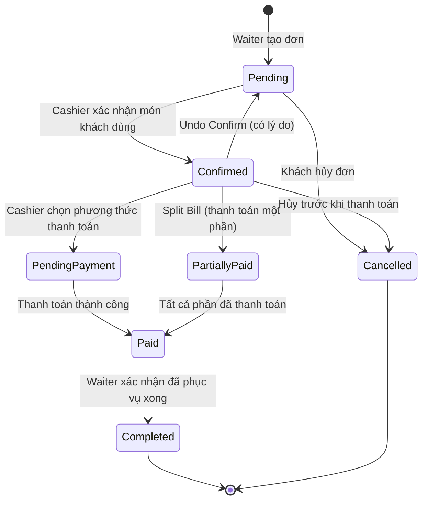

# Luồng Trạng Thái Order (Order Status Workflow)
## SapaForest Restaurant Management System

---

## 📋 Tổng Quan

Document này mô tả chi tiết **luồng trạng thái của Order** từ lúc tạo đến khi hoàn tất trong hệ thống SapaForest RMS.

**Ngày tạo:** 20/11/2025  
**Version:** 1.0  
**Scope:** Backend + Frontend Integration

---

## 🔄 Sơ Đồ Luồng Trạng Thái



---

## 📊 Các Trạng Thái Chi Tiết

### 1️⃣ **Pending** (Chờ xác nhận)

**Mô tả:**  
Đơn hàng mới được tạo bởi Waiter, chưa được khách xác nhận số lượng món đã sử dụng.

**Điều kiện:**
- Order mới tạo
- Khách chưa kiểm tra món ăn

**Người thực hiện:** Waiter

**Code:**
```csharp
// Backend/BusinessAccessLayer/Services/OrderTableService.cs
order.Status = "Pending";
```

**Frontend hiển thị:**
```
Status: "Chờ xác nhận"
Badge: bg-warning text-dark (Vàng)
```

**Hành động tiếp theo:**
- ✅ Cashier có thể mở và xem đơn
- ✅ Chuyển sang `Confirmed` khi khách xác nhận món
- ✅ Có thể `Cancel` nếu khách hủy

---

### 2️⃣ **Confirmed** (Đã xác nhận)

**Mô tả:**  
Khách đã kiểm tra và xác nhận số lượng món thực tế đã dùng. Đơn sẵn sàng để thanh toán.

**Điều kiện:**
- Cashier đã nhập `QuantityUsed` cho từng món
- Khách đồng ý với bill

**Người thực hiện:** Cashier (tại quầy thu ngân)

**Code:**
```csharp
// Backend/BusinessAccessLayer/Services/PaymentService.cs
order.Status = "Confirmed";
order.ConfirmedAt = DateTime.UtcNow;
order.ConfirmedByStaffId = staffId;
```

**Frontend hiển thị:**
```
Status: "Đã xác nhận"
Badge: bg-primary (Xanh dương)
```

**Hành động tiếp theo:**
- ✅ Cashier chọn phương thức thanh toán → `PendingPayment`
- ✅ Có thể `Undo Confirm` (quay về `Pending`) với lý do
- ❌ Không thể undo nếu đã bắt đầu thanh toán

---

### 3️⃣ **Pending-Payment** (Chờ thanh toán)

**Mô tả:**  
Cashier đã khởi tạo session thanh toán, đang chờ khách thực hiện thanh toán (đặc biệt với QR/Wallet).

**Điều kiện:**
- Cashier đã chọn phương thức thanh toán (QR, Card, Wallet)
- Transaction được tạo với `Status = "Pending"`
- Session QR đã được generate

**Người thực hiện:** Cashier + Customer

**Code:**
```csharp
// Backend/BusinessAccessLayer/Services/PaymentService.cs
var transaction = new Transaction
{
    Status = "Pending",
    SessionId = sessionId
};
// Order vẫn ở trạng thái "Confirmed" hoặc chuyển sang "Pending-Payment"

// 🔓 Giải phóng bàn để phục vụ khách tiếp theo
table.Status = "Available";
await _unitOfWork.Tables.UpdateAsync(table);
```

**Frontend hiển thị:**
```
Status: "Chờ thanh toán"
Badge: bg-info text-dark (Xanh nhạt)
```

**📌 Table Status Change:**
- ⚠️ **QUAN TRỌNG:** Khi thanh toán được khởi tạo, bàn sẽ được **giải phóng ngay lập tức** (`Table.Status = "Available"`)
- **Lý do:** Cho phép bàn phục vụ khách hàng tiếp theo ngay sau khi khách hiện tại bắt đầu thanh toán
- Khách đã ăn xong và đang thanh toán → Bàn có thể dọn và sẵn sàng cho khách mới

**Hành động tiếp theo:**
- ✅ Cashier xác nhận thanh toán thành công → `Paid`
- ✅ Có thể Cancel session và chọn phương thức khác
- ⏱️ Session timeout sau 15 phút (configurable)

---

### 4️⃣ **PartiallyPaid** (Thanh toán một phần)

**Mô tả:**  
Đơn hàng đang được thanh toán theo Split Bill, một số phần đã thanh toán nhưng chưa đủ.

**Điều kiện:**
- Cashier chọn "Chia hóa đơn"
- Ít nhất 1 phần đã thanh toán
- Còn phần khác chưa thanh toán

**Người thực hiện:** Cashier

**Code:**
```csharp
// Backend/BusinessAccessLayer/Services/PaymentService.cs
if (allPaid) 
{
    order.Status = "Paid";
}
else 
{
    order.Status = "PartiallyPaid";
}
```

**Frontend hiển thị:**
```
Status: "Thanh toán một phần"
Badge: bg-warning text-dark (Vàng)
Progress: "Đã thanh toán 2/3 phần"
```

**Hành động tiếp theo:**
- ✅ Tiếp tục thanh toán các phần còn lại
- ✅ Khi tất cả phần đã paid → `Paid`

---

### 5️⃣ **Paid** (Đã thanh toán)

**Mô tả:**  
Khách đã thanh toán đủ số tiền. Hệ thống đã ghi nhận giao dịch thành công.

**Điều kiện:**
- Transaction có `Status = "Paid"`
- Order.TotalAmount đã được thanh toán đầy đủ
- Receipt đã được generate

**Người thực hiện:** System (sau khi Cashier confirm)

**Code:**
```csharp
// Backend/BusinessAccessLayer/Services/PaymentService.cs
transaction.Status = "Paid";
transaction.CompletedAt = DateTime.UtcNow;
order.Status = "Paid";
await TriggerPostPaymentActionsAsync(orderId, transactionId);

// Lưu ý: Bàn đã được giải phóng từ lúc bắt đầu thanh toán (Pending-Payment)
```

**Frontend hiển thị:**
```
Status: "Đã thanh toán"
Badge: bg-success (Xanh lá)
```

**📌 Table Status:**
- ✅ Bàn đã được giải phóng (`Table.Status = "Available"`) từ khi thanh toán được khởi tạo
- Bàn có thể được dọn dẹp và phục vụ khách hàng mới ngay lập tức

**Hành động tiếp theo:**
- ✅ Cashier in/gửi hóa đơn cho khách
- ✅ Waiter dọn bàn và sẵn sàng phục vụ khách mới
- ✅ Order chuyển sang `Completed` khi waiter xác nhận hoàn tất
- 🔒 Không thể chỉnh sửa hay hủy đơn

---

### 6️⃣ **Completed** (Hoàn tất)

**Mô tả:**  
Đơn hàng đã hoàn tất toàn bộ quy trình: phục vụ → thanh toán → dọn bàn.

**Điều kiện:**
- Order đã `Paid`
- Waiter xác nhận đã dọn bàn xong
- Table đã ở trạng thái `Available` (được giải phóng từ lúc thanh toán)

**Người thực hiện:** Waiter

**Code:**
```csharp
// Backend/BusinessAccessLayer/Services/TableService.cs
order.Status = "Completed";
// Lưu ý: table.Status đã = "Available" từ trước (khi bắt đầu thanh toán)
```

**Frontend hiển thị:**
```
Status: "Hoàn tất"
Badge: bg-success (Xanh lá)
```

**📌 Table Status:**
- ℹ️ Bàn đã được giải phóng từ khi thanh toán được khởi tạo (status `Pending-Payment`)
- Bước này chỉ đánh dấu order là hoàn tất, không thay đổi trạng thái bàn

**Hành động tiếp theo:**
- 📊 Dữ liệu được archive/báo cáo
- 🔒 Đơn hàng read-only (chỉ xem)

---

### 7️⃣ **Cancelled** (Đã hủy)

**Mô tả:**  
Đơn hàng bị hủy vì lý do nào đó (khách không đến, khách hủy món, nhập sai, v.v.)

**Điều kiện:**
- Chưa thanh toán (`Status != "Paid"`)
- Có lý do hủy hợp lệ
- Staff có quyền Cancel

**Người thực hiện:** Waiter hoặc Manager

**Code:**
```csharp
// Backend/BusinessAccessLayer/Services/OrderService.cs
if (order.Status == "Paid")
{
    throw new InvalidOperationException("Không thể hủy đơn đã thanh toán");
}
order.Status = "Cancelled";
order.CancelledAt = DateTime.UtcNow;
order.CancelledByStaffId = staffId;
order.CancellationReason = reason;
```

**Frontend hiển thị:**
```
Status: "Đã hủy"
Badge: bg-danger (Đỏ)
```

**Hành động tiếp theo:**
- 📝 Log vào OrderHistory với lý do
- 🔓 Unlock bàn nếu đã lock
- 🔒 Không thể khôi phục (permanent)

---

## 🪑 Quản Lý Trạng Thái Bàn (Table Status Management)

### ⚡ Business Rule: Giải Phóng Bàn Khi Thanh Toán

**Nguyên tắc quan trọng:**
> **Khi thanh toán được khởi tạo hoặc đơn hàng đang được thanh toán, bàn sẽ được giải phóng ngay lập tức để phục vụ khách hàng tiếp theo.**

### 📊 Bảng Thay Đổi Trạng Thái Bàn

| Order Status | Table Status | Thời điểm thay đổi | Lý do |
|--------------|--------------|-------------------|-------|
| `Pending` | `Occupied` | Waiter tạo order | Khách đang ngồi và chưa ăn xong |
| `Confirmed` | `Occupied` | Cashier xác nhận món | Khách đã ăn xong, đang kiểm tra bill |
| **`Pending-Payment`** | **`Available`** | **Cashier khởi tạo thanh toán** | **🔓 Giải phóng bàn - khách đã ăn xong** |
| `Paid` | `Available` | Thanh toán hoàn tất | Bàn vẫn available (đã giải phóng từ trước) |
| `PartiallyPaid` | `Available` | Split bill bắt đầu | Bàn vẫn available (đã giải phóng từ trước) |
| `Completed` | `Available` | Waiter xác nhận hoàn tất | Bàn vẫn available (đã giải phóng từ trước) |
| `Cancelled` | `Available` | Order bị hủy | Giải phóng bàn |

### 🎯 Logic và Lý Do

**1. Tại sao giải phóng bàn khi bắt đầu thanh toán?**
- ✅ Khách đã ăn xong và đang thanh toán → Không cần giữ bàn nữa
- ✅ Tối ưu hóa việc phục vụ: Waiter có thể bắt đầu dọn bàn ngay
- ✅ Bàn sẵn sàng cho khách hàng tiếp theo nhanh hơn
- ✅ Tăng hiệu suất sử dụng bàn (table turnover rate)

**2. Luồng hoạt động thực tế:**
```
[Khách ăn xong] → [Gọi thu ngân] → [Xác nhận món] → [Bắt đầu thanh toán]
                                                              ↓
                                                    🔓 BÀN ĐƯỢC GIẢI PHÓNG
                                                              ↓
[Waiter bắt đầu dọn bàn] ← ← ← ← ← ← ← ← ← ← ← [Thu ngân xử lý thanh toán]
         ↓
[Bàn sẵn sàng cho khách mới]
```

**3. Implementation trong code:**

```csharp
// Backend/BusinessAccessLayer/Services/PaymentService.cs

// Khi khởi tạo thanh toán (bất kỳ phương thức nào)
public async Task<TransactionDto> InitiatePaymentAsync(...)
{
    // ... validate order ...
    
    // Tạo transaction
    var transaction = new Transaction { ... };
    await _unitOfWork.Payments.SaveTransactionAsync(transaction);
    
    // 🔓 GIẢI PHÓNG BÀN NGAY TẠI ĐÂY
    var table = await _unitOfWork.Tables.GetTableByOrderIdAsync(orderId);
    if (table != null)
    {
        table.Status = "Available";
        await _unitOfWork.Tables.UpdateAsync(table);
        
        // Log table release
        await _auditLogService.LogEventAsync(
            "table_released",
            "Table",
            table.TableId,
            $"Bàn được giải phóng khi bắt đầu thanh toán cho Order {orderId}",
            null, userId, null, ct
        );
    }
    
    return transaction;
}
```

### ⚠️ Lưu Ý Quan Trọng

1. **Bàn được giải phóng NGAY KHI THANH TOÁN BẮT ĐẦU**, không phải khi thanh toán hoàn tất
2. **Order Status `Paid` và `Completed`** không làm thay đổi table status (vì đã thay đổi từ trước)
3. **Waiter có thể bắt đầu dọn bàn ngay** khi thấy khách đang ở quầy thu ngân
4. **Hệ thống cho phép đặt bàn mới** ngay khi table status = "Available"

---

## 🔀 Các Chuyển Đổi Trạng Thái (State Transitions)

### ✅ Chuyển đổi hợp lệ:

| Từ trạng thái | Đến trạng thái | Điều kiện | Người thực hiện |
|---------------|----------------|-----------|-----------------|
| `Pending` | `Confirmed` | Cashier xác nhận món với khách | Cashier |
| `Confirmed` | `Pending` | Undo Confirm (có lý do) | Cashier |
| `Confirmed` | `Pending-Payment` | Khởi tạo session thanh toán | Cashier |
| `Confirmed` | `PartiallyPaid` | Split bill, thanh toán 1 phần | Cashier |
| `Pending-Payment` | `Paid` | Xác nhận thanh toán thành công | Cashier/System |
| `PartiallyPaid` | `Paid` | Tất cả phần đã thanh toán | System |
| `Paid` | `Completed` | Waiter xác nhận dọn bàn xong | Waiter |
| `Pending` | `Cancelled` | Hủy đơn chưa xác nhận | Waiter/Manager |
| `Confirmed` | `Cancelled` | Hủy đơn đã xác nhận nhưng chưa paid | Manager |

### ❌ Chuyển đổi KHÔNG hợp lệ:

| Từ trạng thái | Đến trạng thái | Lý do |
|---------------|----------------|-------|
| `Paid` | `Pending` | Không thể rollback sau khi đã thanh toán |
| `Paid` | `Confirmed` | Không thể rollback sau khi đã thanh toán |
| `Paid` | `Cancelled` | Không thể hủy đơn đã thanh toán |
| `Completed` | `Paid` | Không thể rollback từ Completed |
| `Cancelled` | `Any` | Không thể khôi phục đơn đã hủy |

---

## 🛠️ Implementation Details

### Backend Constants

**File:** `Backend/BusinessAccessLayer/Constants/OrderStatusConstants.cs`

```csharp
public static class OrderStatusConstants
{
    public const string WaitingConfirmation = "waiting-confirmation";
    public const string Confirmed = "confirmed";
    public const string PendingPayment = "pending-payment";
    public const string Paid = "paid";
    public const string Completed = "completed";
    public const string Cancelled = "cancelled";
    public const string PartiallyPaid = "partially-paid";
}
```

---

### Status Check Helper

```csharp
private static readonly HashSet<string> PendingStatuses = new(StringComparer.OrdinalIgnoreCase)
{
    "Pending",
    "pending-payment",
    "WaitingForPayment",
    "Processing",
    "Confirmed"
};

private static readonly HashSet<string> ProcessedStatuses = new(StringComparer.OrdinalIgnoreCase)
{
    "Paid",
    "Completed",
    "Success"
};
```

---

### Frontend Status Mapping

**File:** `Frontend/WebSapaForestForStaff/Views/CashierFlow/ConfirmOrder.cshtml`

```csharp
string GetStatusDisplayText() => normalizedStatus switch
{
    "pending" => "Chờ xác nhận",
    "confirmed" => "Đã xác nhận",
    "pending-payment" => "Chờ thanh toán",
    "paid" => "Đã thanh toán",
    "completed" => "Hoàn tất",
    "cancelled" => "Đã hủy",
    "partially-paid" => "Thanh toán một phần",
    _ => Model.Status ?? "Không rõ"
};
```

---

## 📝 OrderHistory Tracking

Mọi thay đổi trạng thái quan trọng đều được log vào bảng `OrderHistory`:

```csharp
var history = new OrderHistory
{
    OrderId = orderId,
    Action = "Status Changed",
    Reason = reason,
    StaffId = staffId,
    OldStatus = oldStatus,
    NewStatus = newStatus,
    CreatedAt = DateTime.UtcNow
};
await _unitOfWork.Payments.AddOrderHistoryAsync(history);
```

**Các hành động được log:**
- ✅ `Order Created`
- ✅ `Customer Confirmed`
- ✅ `Undo Confirmation`
- ✅ `Payment Initiated`
- ✅ `Payment Confirmed`
- ✅ `Order Cancelled`
- ✅ `Order Completed`

---

## 🔒 Order Locking Mechanism

Để tránh race condition khi nhiều user cùng xử lý 1 đơn:

```csharp
// Lock order trước khi xử lý thanh toán
await LockOrderAsync(orderId, userId, "Payment Processing");

try
{
    // Process payment...
    order.Status = "Paid";
    await _unitOfWork.SaveChangesAsync();
}
finally
{
    // Always unlock
    await UnlockOrderAsync(orderId);
}
```

**Thời gian lock:** 5 phút (timeout tự động)

---

## 🧪 Test Cases

### TC1: Normal Flow
```
Pending → Confirmed → Pending-Payment → Paid → Completed
```

**Steps:**
1. Waiter tạo đơn → `Pending`
2. Cashier confirm với khách → `Confirmed`
3. Cashier chọn QR payment → `Pending-Payment`
4. Khách chuyển khoản, cashier confirm → `Paid`
5. Waiter dọn bàn xong → `Completed`

### TC2: Undo Confirm
```
Pending → Confirmed → Pending → Confirmed → Paid
```

**Steps:**
1. Cashier confirm sai → `Confirmed`
2. Cashier nhận ra lỗi, undo confirm với lý do → `Pending`
3. Cashier confirm lại đúng → `Confirmed`
4. Thanh toán → `Paid`

### TC3: Split Bill
```
Confirmed → PartiallyPaid → PartiallyPaid → Paid
```

**Steps:**
1. 3 khách chia bill
2. Khách 1 thanh toán → `PartiallyPaid` (1/3)
3. Khách 2 thanh toán → `PartiallyPaid` (2/3)
4. Khách 3 thanh toán → `Paid` (3/3)

### TC4: Cancellation
```
Pending → Cancelled
```

**Steps:**
1. Waiter tạo đơn nhầm bàn
2. Manager hủy đơn với lý do → `Cancelled`

---

## 🚨 Business Rules

### Rule 1: Không thể thanh toán nếu chưa Confirm
```csharp
if (order.Status != "Confirmed")
{
    throw new InvalidOperationException(
        "Đơn hàng chưa được khách xác nhận. Vui lòng xác nhận trước khi thanh toán."
    );
}
```

### Rule 2: Không thể Undo Confirm sau khi đã bắt đầu thanh toán
```csharp
if (order.Payments != null && order.Payments.Any(p => p.PaymentDate.HasValue))
{
    throw new InvalidOperationException(
        "Không thể hoàn tác vì đơn hàng đã bắt đầu thanh toán."
    );
}
```

### Rule 3: Không thể hủy đơn đã thanh toán
```csharp
if (order.Status == "Paid" || order.Status == "Completed")
{
    throw new InvalidOperationException(
        "Không thể hủy đơn hàng đã thanh toán."
    );
}
```

### Rule 4: Phải có lý do khi Undo hoặc Cancel
```csharp
if (string.IsNullOrWhiteSpace(request.Reason))
{
    throw new ArgumentException("Vui lòng nhập lý do.");
}
```

---

## 📊 Status Statistics

Query để lấy thống kê theo trạng thái:

```sql
SELECT 
    Status,
    COUNT(*) as TotalOrders,
    SUM(TotalAmount) as TotalRevenue
FROM Orders
WHERE CreatedAt >= DATEADD(day, -7, GETDATE())
GROUP BY Status
ORDER BY TotalOrders DESC;
```

---

## 🔗 Related Documentation

- [PAYMENT_WORKFLOW_REDESIGN.md](../Backend/PAYMENT_WORKFLOW_REDESIGN.md)
- [COMPLETE_PAYMENT_WORKFLOW.md](../Backend/COMPLETE_PAYMENT_WORKFLOW.md)
- [ORDER_STATUS_LOCALIZATION.md](../Frontend/WebSapaForestForStaff/Docs/ORDER_STATUS_LOCALIZATION.md)
- [CASHIER_WORKFLOW_ANALYSIS.md](./CASHIER_WORKFLOW_ANALYSIS.md)

---

## 📞 Contact

**Maintainer:** Backend Team + Frontend Team  
**Last Updated:** 20/11/2025  
**Version:** 1.0

