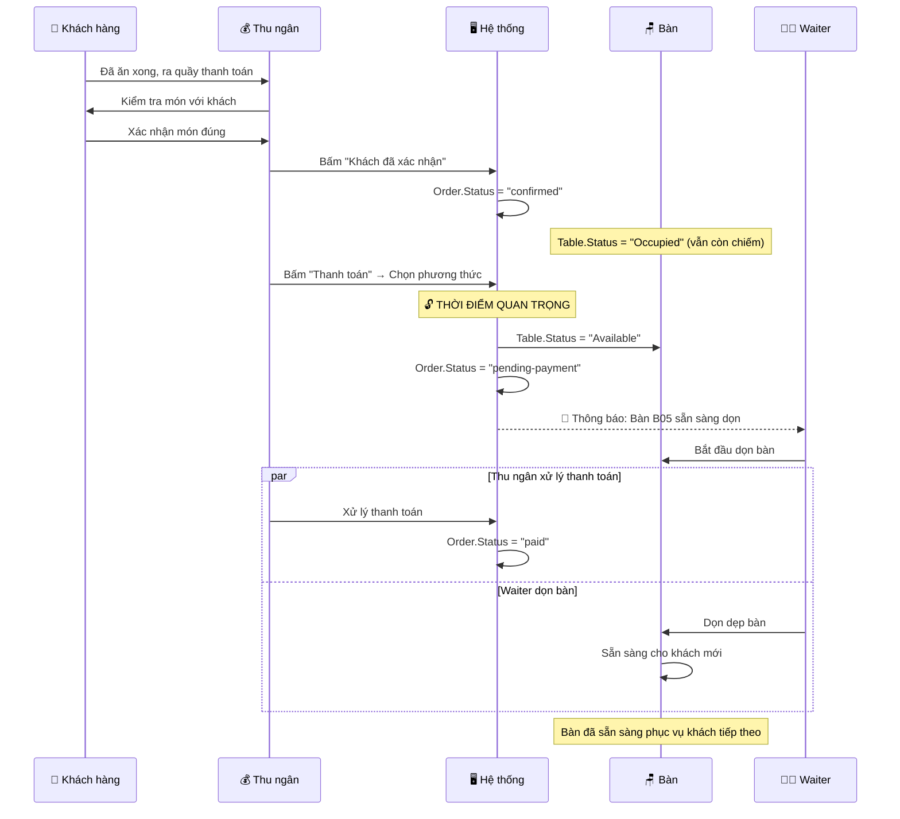

# Table Status Release Policy
## SapaForest Restaurant Management System

---

## 📋 Tổng Quan

Document này mô tả **chính sách giải phóng bàn khi thanh toán** - một business rule quan trọng để tối ưu hóa hiệu suất phục vụ.

**Ngày tạo:** 25/11/2025  
**Version:** 1.0  
**Áp dụng cho:** Tất cả flow thanh toán (Cash, QR, Card, Split Bill)

---

## 🎯 Business Rule

### Nguyên tắc cốt lõi:

> **Khi thanh toán được khởi tạo (payment initiated) hoặc đơn hàng đang được thanh toán, bàn sẽ được giải phóng NGAY LẬP TỨC (Table Status = "Available") để phục vụ khách hàng tiếp theo.**

---

## ⏰ Timeline - Khi Nào Bàn Được Giải Phóng?



---

## 📊 Bảng Trạng Thái Chi Tiết

| Order Status | Table Status | Thời điểm | Ai thực hiện | Ghi chú |
|--------------|--------------|-----------|--------------|---------|
| `waiting-confirmation` | `Occupied` | Waiter tạo order | Waiter | Khách đang ngồi và ăn |
| `confirmed` | `Occupied` | Cashier xác nhận món | Cashier | Khách đã ăn xong, đang ở quầy |
| **`pending-payment`** | **`Available`** | **Cashier khởi tạo thanh toán** | **System (tự động)** | **🔓 BÀN ĐƯỢC GIẢI PHÓNG** |
| `paid` | `Available` | Thanh toán hoàn tất | System | Bàn vẫn available |
| `partially-paid` | `Available` | Split bill bắt đầu | System | Bàn vẫn available |
| `completed` | `Available` | Waiter hoàn tất | Waiter | Bàn vẫn available |
| `cancelled` | `Available` | Order bị hủy | System | Bàn được giải phóng |

---

## ✅ Lợi Ích

### 1. Tối Ưu Hóa Hiệu Suất Phục Vụ

- ✅ **Waiter có thể dọn bàn ngay:** Không cần chờ khách thanh toán xong
- ✅ **Giảm thời gian chờ cho khách mới:** Bàn sẵn sàng nhanh hơn 5-10 phút
- ✅ **Tăng table turnover rate:** Phục vụ nhiều khách hơn trong cùng thời gian

### 2. Cải Thiện Trải Nghiệm Khách Hàng

- ✅ **Khách mới không phải chờ lâu** để có bàn trống
- ✅ **Quy trình phục vụ mượt mà** và chuyên nghiệp
- ✅ **Tránh tình trạng** bàn trống nhưng vẫn hiển thị "Occupied"

### 3. Tăng Doanh Thu

- ✅ **Phục vụ được nhiều lượt khách hơn** mỗi ngày
- ✅ **Tối đa hóa sử dụng bàn** trong giờ cao điểm
- ✅ **Giảm thời gian bàn "idle"** (trống nhưng chưa được sử dụng)

---

## 🛠️ Implementation

### Backend Code

**File:** `Backend/BusinessAccessLayer/Services/PaymentService.cs`

```csharp
/// <summary>
/// Khởi tạo thanh toán - Giải phóng bàn tại đây
/// </summary>
public async Task<TransactionDto> InitiatePaymentAsync(
    PaymentInitiateRequestDto request, 
    int userId, 
    CancellationToken ct = default)
{
    // Step 1: Validate order
    var order = await _unitOfWork.Payments.GetByIdAsync(request.OrderId);
    if (order == null)
        throw new KeyNotFoundException($"Order {request.OrderId} not found");
    
    if (order.Status != OrderStatusConstants.Confirmed)
        throw new InvalidOperationException("Order must be confirmed before payment");
    
    // Step 2: Create transaction
    var transaction = new Transaction
    {
        OrderId = request.OrderId,
        PaymentMethod = request.PaymentMethod,
        Amount = order.TotalAmount ?? 0,
        Status = "Pending",
        CreatedAt = DateTime.UtcNow,
        SessionId = GenerateSessionId()
    };
    
    await _unitOfWork.Payments.SaveTransactionAsync(transaction);
    
    // Step 3: Update order status
    order.Status = OrderStatusConstants.PendingPayment;
    await _unitOfWork.Payments.UpdateAsync(order);
    
    // Step 4: 🔓 GIẢI PHÓNG BÀN NGAY TẠI ĐÂY
    var table = await _unitOfWork.Tables.GetTableByOrderIdAsync(request.OrderId);
    if (table != null)
    {
        table.Status = "Available";
        await _unitOfWork.Tables.UpdateAsync(table);
        
        // Log table release
        await _auditLogService.LogEventAsync(
            eventType: "table_released",
            entityType: "Table",
            entityId: table.TableId,
            description: $"Bàn {table.TableNumber} được giải phóng khi bắt đầu thanh toán cho Order {request.OrderId}",
            userId: userId,
            ct: ct
        );
        
        // Thông báo cho Waiter qua SignalR
        await _hubContext.Clients.All.SendAsync(
            "TableStatusUpdated", 
            new { 
                tableId = table.TableId,
                tableNumber = table.TableNumber,
                status = "Available",
                orderId = request.OrderId,
                message = $"Bàn {table.TableNumber} sẵn sàng để dọn"
            },
            ct
        );
    }
    
    await _unitOfWork.SaveChangesAsync(ct);
    
    return _mapper.Map<TransactionDto>(transaction);
}
```

### Áp Dụng Cho Tất Cả Payment Methods

Quy tắc này áp dụng cho **TẤT CẢ** các phương thức thanh toán:

1. **Cash Payment (Tiền mặt):**
   - Bàn giải phóng khi bắt đầu thanh toán tiền mặt
   
2. **QR/Banking Payment:**
   - Bàn giải phóng khi generate QR code
   
3. **Card Payment:**
   - Bàn giải phóng khi khởi tạo card transaction
   
4. **Split Bill (Chia hóa đơn):**
   - Bàn giải phóng khi bắt đầu split bill (phần đầu tiên)
   
5. **Combined Payment (Kết hợp):**
   - Bàn giải phóng khi bắt đầu phương thức đầu tiên

---

## ⚠️ Lưu Ý Quan Trọng

### Cho Thu Ngân (Cashier):

1. ✅ **Bàn được giải phóng TỰ ĐỘNG** khi bạn bấm "Thanh toán"
2. ✅ **KHÔNG CẦN** thao tác thủ công để giải phóng bàn
3. ✅ Nếu cancel payment, bàn vẫn ở trạng thái "Available" (không rollback)

### Cho Waiter:

1. ✅ **Bắt đầu dọn bàn NGAY** khi thấy table status = "Available"
2. ✅ **KHÔNG CẦN CHỜ** khách thanh toán xong
3. ✅ Nếu thấy khách ở quầy thu ngân = có thể dọn bàn rồi

### Cho Manager/Admin:

1. ✅ Theo dõi **table turnover rate** để đánh giá hiệu quả
2. ✅ Đảm bảo Waiter **được training** về quy trình mới này
3. ✅ Kiểm tra logs để đảm bảo bàn được giải phóng đúng cách

---

## 🔍 Monitoring & Metrics

### Các Metrics Cần Theo Dõi:

1. **Average Table Turnover Time:**
   - Thời gian trung bình từ lúc bàn được giải phóng đến khi phục vụ khách mới
   - Target: < 10 phút

2. **Table Release Success Rate:**
   - % số lần bàn được giải phóng thành công khi payment initiated
   - Target: 100%

3. **Time Between Payment Start & Table Cleaning:**
   - Thời gian từ lúc thanh toán bắt đầu đến khi Waiter dọn xong
   - Target: < 5 phút

4. **Customer Wait Time For Tables:**
   - Thời gian khách chờ để có bàn trống
   - Target: Giảm 30-50% so với trước

### Audit Logs:

Hệ thống tự động log các sự kiện:

```json
{
  "eventType": "table_released",
  "entityType": "Table",
  "entityId": 15,
  "timestamp": "2025-11-25T10:30:45Z",
  "userId": 42,
  "description": "Bàn B05 được giải phóng khi bắt đầu thanh toán cho Order 1234",
  "metadata": {
    "tableNumber": "B05",
    "orderId": 1234,
    "orderStatus": "pending-payment",
    "previousTableStatus": "Occupied",
    "newTableStatus": "Available"
  }
}
```

---

## ❓ FAQ - Câu Hỏi Thường Gặp

### Q1: Nếu khách thanh toán lâu (VD: QR không quét được), bàn có bị chiếm lại không?

**A:** Không. Bàn đã được giải phóng và sẽ ở trạng thái "Available". Khách đang thanh toán ở quầy thu ngân, không ảnh hưởng đến bàn. Waiter có thể dọn bàn và phục vụ khách mới.

### Q2: Nếu cần cancel payment, bàn có quay lại "Occupied" không?

**A:** Không. Bàn vẫn giữ trạng thái "Available" vì khách đã ăn xong. Nếu khách muốn ngồi lại và gọi thêm món, cần tạo order mới cho bàn đó.

### Q3: Waiter có thể dọn bàn khi khách vẫn đang thanh toán không?

**A:** Có, hoàn toàn được. Đó chính là mục đích của quy tắc này - tối ưu hóa thời gian. Khách đã ăn xong và đang ở quầy thanh toán rồi, không cần bàn nữa.

### Q4: Nếu khách thanh toán xong nhưng quên đồ, muốn quay lại bàn thì sao?

**A:** Khách có thể quay lại lấy đồ. Nếu bàn chưa có khách mới thì không vấn đề gì. Nếu đã có khách mới thì Waiter hỗ trợ lấy đồ giúp.

### Q5: Chính sách này có áp dụng cho bàn VIP/Private Room không?

**A:** Có, áp dụng như nhau. Tuy nhiên có thể điều chỉnh thời gian dọn dẹp cho phù hợp với tiêu chuẩn cao hơn của VIP room.

### Q6: Nếu khách ăn buffet (thanh toán trước), bàn được giải phóng khi nào?

**A:** Buffet là trường hợp đặc biệt - khách thanh toán trước, ăn sau. Bàn chỉ được giải phóng khi khách rời đi và Waiter xác nhận hoàn tất, không phải khi thanh toán.

---

## 📚 Related Documents

- [ORDER_STATUS_WORKFLOW.md](./ORDER_STATUS_WORKFLOW.md) - Chi tiết về trạng thái đơn hàng
- [CASHIER_PAYMENT_COMPLETE_WORKFLOW.md](./CASHIER_PAYMENT_COMPLETE_WORKFLOW.md) - Workflow thanh toán đầy đủ
- [COMPLETE_PAYMENT_WORKFLOW.md](./COMPLETE_PAYMENT_WORKFLOW.md) - Luồng thanh toán hoàn chỉnh

---

## 📝 Version History

| Version | Date | Changes | Author |
|---------|------|---------|--------|
| 1.0 | 2025-11-25 | Initial version - Table release policy | System |

---

**✅ Approved by:** Management Team  
**📅 Effective Date:** 2025-11-25  
**🔄 Review Cycle:** Quarterly

